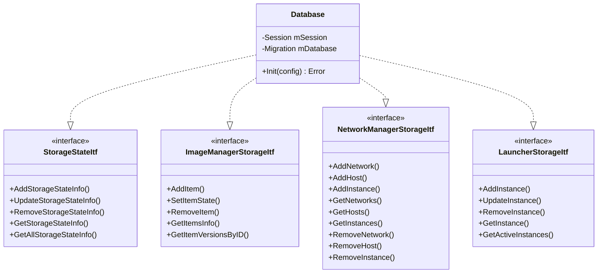

# CM Database Module

## Overview

The CM (Communication Manager) Database class provides persistent storage for various CM modules. It implements multiple
storage interfaces using SQLite as the backend database.

The `Database` class implements the following interfaces to persist data for different CM modules:

- [aos::cm::storagestate::StorageItf][storagestate-storage-itf] - storage state interface;
- [aos::cm::imagemanager::StorageItf][iamgemanager-storage-itf] - image manager interface;
- [aos::cm::networkmanager::StorageItf](../networkmanager/itf/storage.hpp) - network manager interface;
- [aos::cm::launcher::StorageItf][launcher-storage-itf] - launcher interface.

## Class Diagram



## Database Schema

### Tables

#### 1. `storagestate`

Stores instance storage and state quota information.

| Column         | Type    | Description                    |
|----------------|---------|--------------------------------|
| itemID         | TEXT    | Service/component ID           |
| subjectID      | TEXT    | Subject identifier             |
| instance       | INTEGER | Instance number                |
| storageQuota   | INTEGER | Storage quota in bytes         |
| stateQuota     | INTEGER | State quota in bytes           |
| stateChecksum  | BLOB    | State checksum                 |

**Primary Key**: `(itemID, subjectID, instance)`

#### 2. `imagemanager`

Stores image manager item information and metadata.

| Column      | Type    | Description                        |
|-------------|---------|----------------------------------- |
| id          | TEXT    | Item identifier                    |
| type        | TEXT    | Item type (service/layer/component)|
| version     | TEXT    | Item version                       |
| state       | TEXT    | Item state                         |
| path        | TEXT    | File system path                   |
| totalSize   | INTEGER | Total size in bytes                |
| gid         | INTEGER | Group ID                           |
| timestamp   | INTEGER | Timestamp in nanoseconds           |
| images      | TEXT    | JSON array of image metadata       |

**Primary Key**: `(id, version)`

#### 3. `networks`

Stores network definitions.

| Column    | Type    | Description       |
|-----------|---------|-------------------|
| networkID | TEXT    | Network identifier|
| subnet    | TEXT    | Subnet CIDR       |
| vlanID    | INTEGER | VLAN ID           |

**Primary Key**: `(networkID)`

#### 4. `hosts`

Stores host information within networks.

| Column    | Type | Description       |
|-----------|------|-------------------|
| networkID | TEXT | Network identifier|
| nodeID    | TEXT | Node identifier   |
| ip        | TEXT | IP address        |

**Primary Key**: `(networkID, nodeID)`

#### 5. `networkmanager_instances`

Stores network instance configurations.

| Column       | Type    | Description              |
|--------------|---------|--------------------------|
| itemID       | TEXT    | Service/component ID     |
| subjectID    | TEXT    | Subject identifier       |
| instance     | INTEGER | Instance number          |
| networkID    | TEXT    | Network identifier       |
| nodeID       | TEXT    | Node identifier          |
| ip           | TEXT    | IP address               |
| exposedPorts | TEXT    | JSON array of ports      |
| dnsServers   | TEXT    | JSON array of DNS servers|

**Primary Key**: `(itemID, subjectID, instance)`

#### 6. `launcher_instances`

Stores launcher instance information.

| Column         | Type    | Description              |
|----------------|---------|--------------------------|
| itemID         | TEXT    | Service/component ID     |
| subjectID      | TEXT    | Subject identifier       |
| instance       | INTEGER | Instance number          |
| imageID        | TEXT    | Image identifier         |
| updateItemType | TEXT    | Update item type         |
| nodeID         | TEXT    | Current node ID          |
| prevNodeID     | TEXT    | Previous node ID         |
| runtimeID      | TEXT    | Runtime identifier       |
| uid            | INTEGER | User ID                  |
| timestamp      | INTEGER | Timestamp in nanoseconds |
| cached         | INTEGER | Cached indicator (0/1)   |

**Primary Key**: `(itemID, subjectID, instance)`

## Data Conversion

The module uses a consistent pattern for converting between AOS types and database rows:

```cpp
void FromAos(const AosType& src, RowType& dst);  // AOS → Database
void ToAos(const RowType& src, AosType& dst);    // Database → AOS
```

### Column Index Enums

Each table has a corresponding `enum class` for type-safe column access:

```cpp
enum class StorageStateInstanceInfoColumns : int {
    eItemID = 0,
    eSubjectID,
    eInstance,
    // ...
};
```

The `ToInt()` helper function converts enum values to integers for use with Poco::Tuple template parameters.

## JSON Serialization

Complex nested structures are serialized to JSON for storage in TEXT/BLOB columns:

- image metadata — `ImageInfo` arrays with platform details, SHA256 hashes;
- exposed ports — arrays of protocol/port pairs;
- DNS servers — arrays of DNS server addresses.

Helper functions in the anonymous namespace handle serialization:

- `SerializeImages()` / `DeserializeImages()`;
- `SerializeExposedPorts()` / `DeserializeExposedPorts()`;
- `SerializeDNSServers()` / `DeserializeDNSServers()`.

## Dependencies

- Poco::Data — database abstraction layer;
- Poco::JSON — JSON serialization/deserialization;
- SQLite — database backend;
- AOS Core — common types, utilities, and interfaces.

## Migration Support

The database uses the common migration framework to support schema evolution across versions. Migration files should be
placed in the configured migration path.

## Configuration

Database configuration is provided through `Config`:

```cpp
struct Config {
    std::string mWorkingDir;         // Database storage directory
    std::string mMigrationPath;      // Migration scripts directory
    std::string mMergedMigrationPath; // Merged migration output
};
```

[storagestate-storage-itf]: https://github.com/aosedge/aos_core_lib_cpp/blob/main/src/core/cm/storagestate/itf/storage.hpp
[iamgemanager-storage-itf]: https://github.com/aosedge/aos_core_lib_cpp/blob/main/src/core/cm/imagemanager/itf/storage.hpp
[launcher-storage-itf]: https://github.com/aosedge/aos_core_lib_cpp/blob/main/src/core/cm/launcher/itf/storage.hpp
