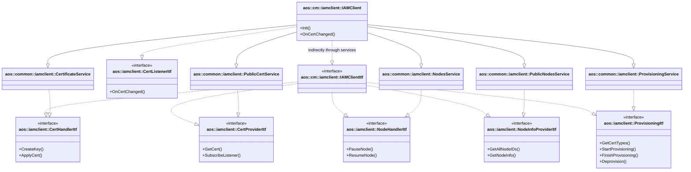

# IAM Client

Provides access to IAM services through gRPC communication with IAM server.

## Overview

The `aos::cm::iamclient::IAMClient` class aggregates multiple gRPC service implementations to provide a unified
IAM client interface. It indirectly implements the [IAMClientItf][iamclient-itf] by inheriting from specific gRPC
service classes, each of which implements one of the required interfaces.

## Indirect inheritance pattern

`IAMClient` achieves interface compatibility with `IAMClientItf` through multiple inheritance from gRPC service
implementations:

### IAMClientItf requirements

The `IAMClientItf` interface requires:

* [aos::iamclient::CertHandlerItf][cert-handler-itf] - handles keys and certificates (renew, provisioning)
* [aos::iamclient::CertProviderItf][cert-provider-itf] - provides info about current keys and certificates
* [aos::iamclient::NodeHandlerItf][node-handler-itf] - handles node states (pause, resume)
* [aos::iamclient::NodeInfoProviderItf][node-info-provider-itf] - provides nodes info
* [aos::iamclient::ProvisioningItf][provisioning-itf] - performs node provisioning

### Service implementation mapping

`IAMClient` inherits from the following gRPC service classes, which implement the required interfaces:

| gRPC Service Class | Implements Interface | Purpose |
|-------------------|---------------------|---------|
| [CertificateService][cert-service] | `CertHandlerItf` | Protected IAM Certificate Service client |
| [PublicCertService][public-cert-service] | `CertProviderItf` | Public IAM Certificate Service client |
| [NodesService][nodes-service] | `NodeHandlerItf` | Protected IAM Nodes Service client |
| [PublicNodesService][public-nodes-service] | `NodeInfoProviderItf` | Public IAM Nodes Service client |
| [ProvisioningService][provisioning-service] | `ProvisioningItf` | Protected IAM Provisioning Service client |

### Additional interface

`IAMClient` also directly implements:

* [aos::iamclient::CertListenerItf][cert-listener-itf] - receives certificate change notifications

## Class diagram



## Certificate change handling

When a certificate changes, `IAMClient` receives notification via the `CertListenerItf::OnCertChanged()` callback
and automatically reconnects all gRPC services to the IAM server using the updated credentials:

1. Certificate change notification received
2. Reconnect `CertificateService` to protected IAM server
3. Reconnect `NodesService` to protected IAM server
4. Reconnect `ProvisioningService` to protected IAM server
5. Reconnect `PublicCertService` to public IAM server
6. Reconnect `PublicNodesService` to public IAM server

## Usage

The `IAMClient` is initialized with both protected and public IAM server URLs:

```cpp
aos::cm::iamclient::IAMClient iamClient;

auto err = iamClient.Init(
    "iam-protected.example.com:8089",  // Protected IAM server
    "iam-public.example.com:8090",      // Public IAM server
    "/var/aos/certs",                   // Certificate storage path
    tlsCredentials,                     // TLS credentials provider
    "client",                           // Certificate type to monitor
    false                               // Use secure connection
);
```

Once initialized, `IAMClient` can be used through any of the implemented interfaces, making it compatible with
`IAMClientItf` without directly inheriting from it.

[iamclient-itf]: https://github.com/aosedge/aos_core_lib_cpp/blob/main/src/core/cm/iamclient/itf/iamclient.hpp
[cert-handler-itf]: https://github.com/aosedge/aos_core_lib_cpp/blob/main/src/core/common/iamclient/itf/certhandler.hpp
[cert-provider-itf]: https://github.com/aosedge/aos_core_lib_cpp/blob/main/src/core/common/iamclient/itf/certprovider.hpp
[node-handler-itf]: https://github.com/aosedge/aos_core_lib_cpp/blob/main/src/core/common/iamclient/itf/nodehandler.hpp
[node-info-provider-itf]: https://github.com/aosedge/aos_core_lib_cpp/blob/main/src/core/common/iamclient/itf/nodeinfoprovider.hpp
[provisioning-itf]: https://github.com/aosedge/aos_core_lib_cpp/blob/main/src/core/common/iamclient/itf/provisioning.hpp
[cert-listener-itf]: https://github.com/aosedge/aos_core_lib_cpp/blob/main/src/core/common/iamclient/itf/certlistener.hpp
[cert-service]: https://github.com/aosedge/aos_core_cpp/tree/feature_unification/src/common/iamclient/certificateservice.hpp
[public-cert-service]: https://github.com/aosedge/aos_core_cpp/tree/feature_unification/src/common/iamclient/publiccertservice.hpp
[nodes-service]: https://github.com/aosedge/aos_core_cpp/tree/feature_unification/src/common/iamclient/nodesservice.hpp
[public-nodes-service]: https://github.com/aosedge/aos_core_cpp/tree/feature_unification/src/common/iamclient/publicnodeservice.hpp
[provisioning-service]: https://github.com/aosedge/aos_core_cpp/tree/feature_unification/src/common/iamclient/provisioningservice.hpp
