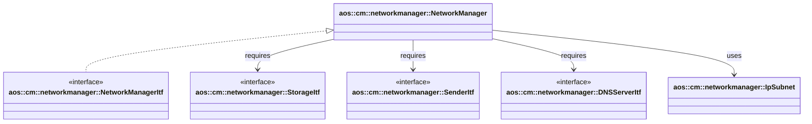

# Network manager

The Network manager is responsible for creating, maintaining, and cleaning up networks for providers and service
instances. It allocates subnets and IP addresses, manages DNS hosts, prepares firewall rules, and exposes network
parameters to other modules.

It implements the following interfaces:

- [aos::cm::networkmanager::NetworkManagerItf][networkmanager-networkmanager-itf] — manager API for network operations;

It requires the following interfaces:

- [aos::cm::networkmanager::StorageItf](itf/storage.hpp) — persistent storage for network state and allocations;
- [aos::common::crypto::RandomItf][crypto-random-itf] — randomness source (e.g., VLAN ID generation);
- [aos::cm::networkmanager::SenderItf](itf/sender.hpp) — sends network configuration (IP, subnet, VLAN ID) to another
  component responsible for creating the VLAN network;
- [aos::cm::networkmanager::DNSServerItf](itf/dnsserver.hpp) — local DNS management (hosts file, restart).

## Initialization

During initialization (`Init`):

- initializes the subnet allocator `IpSubnet` (predefined private networks, scan of used subnets/addresses);
- performs initial cleanup of stale or incomplete network states when necessary.

## Responsibilities

- preparing instance network parameters (`PrepareInstanceNetworkParameters`):
  - pick or create a subnet for a given `networkID`;
  - allocate a free IP address for the instance;
  - generate VLAN ID (bounded by `cMaxVlanID` with `cVlanGenerateRetries` attempts);
  - prepare DNS hostnames for the instance identifiers;
  - prepare firewall rules based on allowed connections and exposed ports;
  - return aggregated `NetworkParameters`.
- updating provider networks (`UpdateProviderNetwork`):
  - create/remove networks for the current provider list;
  - For newly required networks, allocates a subnet and IPs, then uses `SenderItf` to send the network
  configuration (IP, subnet, VLAN ID) to the component responsible for creating the VLAN network.
  - Cleans up empty networks and releases unused subnets/IPs.
- removing instance network parameters (`RemoveInstanceNetworkParameters`):
  - release the IP address;
  - update DNS hosts;
  - remove firewall rules;
  - delete empty networks.
- restarting the DNS server (`RestartDNSServer`).

## Network pools (IPNet pools)

Subnets are derived from predefined private pools. Base CIDR networks and target subnet prefix are configured
in the pools module (`netpool.cpp`).

- `GetNetPools()` returns the split of base networks into subnets of the target size;
- `IpSubnet` uses this split to provide free subnets and IPs.

Example (simplified): base network `172.28.0.0/14` with target prefix `16` yields four `/16` subnets:

- `172.28.0.0/16`, `172.29.0.0/16`, `172.30.0.0/16`, `172.31.0.0/16`.

## aos::cm::networkmanager::NetworkManagerItf

### Init

Initializes the Network manager with `StorageItf`, `RandomItf`, `SenderItf`, and `DNSServerItf`.

### GetInstances

Returns the list of instances with their network parameters according to the manager's state.

### RemoveInstanceNetworkParameters

Removes network parameters for a specific instance: releases IP, updates DNS, removes rules.

### UpdateProviderNetwork

- Synchronizes the set of networks with the provider list.
- For newly required networks, allocates a subnet and IPs, then uses `SenderItf` to send the network
configuration (IP, subnet, VLAN ID) to the component responsible for creating the VLAN network.
- Cleans up empty networks and releases unused subnets/IPs.

### PrepareInstanceNetworkParameters

Prepares network parameters for an instance within `networkID` and `nodeID`:

- finds/creates a subnet, allocates an IP;
- generates DNS hosts and firewall rules;
- returns `NetworkParameters` with a complete dataset.

### RestartDNSServer

Restarts the DNS server to apply hosts updates.

## Subsystems

### aos::cm::networkmanager::IpSubnet

- `Init()` — loads predefined subnets and prepares allocation structures;
- `GetAvailableSubnet(networkID)` — returns/reserves a subnet for a network;
- `GetAvailableIP(networkID)` — returns a free IP address within the network's subnet;
- `ReleaseIPToSubnet(networkID, ip)` — returns the IP back to the pool;
- `RemoveAllocatedSubnet(networkID, subnet, IPs)` — clears allocations for the subnet;
- uses `GetNetPools()` to form subnet pools.

### aos::cm::networkmanager::DNSServerItf

- `UpdateHostsFile(hosts)` — updates the hosts file for provided name→IP mappings;
- `Restart()` — restarts the DNS server process;
- `GetIP()` — returns the current DNS IP address.

[networkmanager-networkmanager-itf]: https://github.com/aosedge/aos_core_lib_cpp/blob/main/src/core/cm/networkmanager/itf/networkmanager.hpp
[crypto-random-itf]: https://github.com/aosedge/aos_core_lib_cpp/blob/main/src/core/common/crypto/itf/rand.hpp
