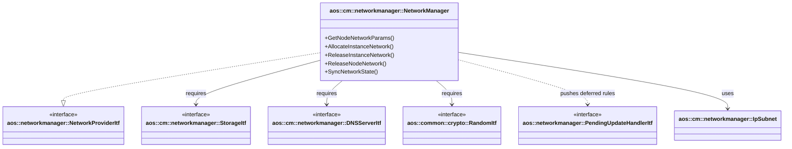
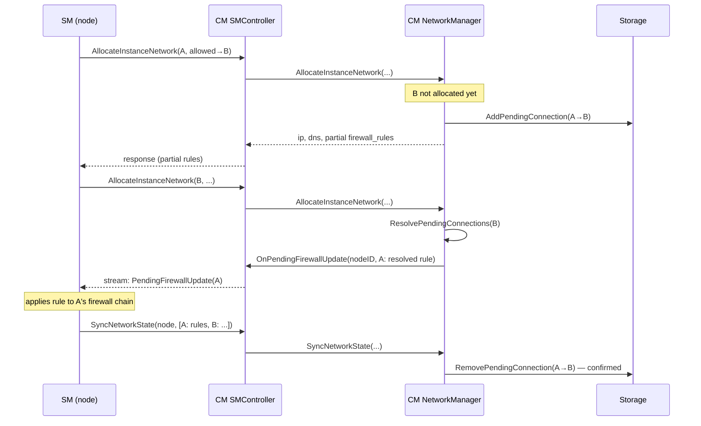

# Network manager

The CM Network manager is the **authority** for instance networks: it allocates
subnets and IP addresses, manages DNS hosts, builds firewall rules from the
instances' allowed connections and exposed ports, and tracks deferred
(inter-instance) firewall rules until they can be resolved. It is the server-side
counterpart of the Service Manager (SM) network stack — SM applies on each node
what CM allocates here.

CM exposes this module to SM over the gRPC `servicemanager.v5.NetworkService`.
The Network manager itself implements the
[aos::networkmanager::NetworkProviderItf][networkprovider-itf] (the SM → CM call
surface); the gRPC plumbing — serving the service, holding the per-node update
stream and pushing deferred updates back — lives in the
[SM controller](../smcontroller). The shared contract types and the SM-side view
are documented in the [common network-manager module][common-net].

## Interfaces

It implements:

- [aos::networkmanager::NetworkProviderItf][networkprovider-itf] — node params,
  instance allocate/release, node release and state sync.

It requires:

- [aos::cm::networkmanager::StorageItf](itf/storage.hpp) — persists network
  state, allocations and **pending connections**;
- [aos::common::crypto::RandomItf][crypto-random-itf] — randomness (e.g. VLAN ID
  generation);
- [aos::cm::networkmanager::DNSServerItf](itf/dnsserver.hpp) — the CM-side DNS
  server (hosts file + reload);
- [aos::networkmanager::PendingUpdateHandlerItf][pendingupdatehandler-itf]
  (optional) — used to push resolved deferred firewall rules; in production this
  is the [SM controller](../smcontroller), which forwards them to SM over the
  `SubscribeInstanceNetworkUpdates` stream.

```mermaid
classDiagram
    class NetworkManager["aos::cm::networkmanager::NetworkManager"] {
        +GetNodeNetworkParams()
        +AllocateInstanceNetwork()
        +ReleaseInstanceNetwork()
        +ReleaseNodeNetwork()
        +SyncNetworkState()
    }

    class NetworkProviderItf["aos::networkmanager::NetworkProviderItf"] {
        <<interface>>
    }
    class PendingUpdateHandlerItf["aos::networkmanager::PendingUpdateHandlerItf"] {
        <<interface>>
    }
    class StorageItf["aos::cm::networkmanager::StorageItf"] {
        <<interface>>
    }
    class DNSServerItf["aos::cm::networkmanager::DNSServerItf"] {
        <<interface>>
    }
    class RandomItf["aos::common::crypto::RandomItf"] {
        <<interface>>
    }
    class IpSubnet["aos::cm::networkmanager::IpSubnet"] {
    }

    NetworkManager ..|> NetworkProviderItf
    NetworkManager --> StorageItf : requires
    NetworkManager --> DNSServerItf : requires
    NetworkManager --> RandomItf : requires
    NetworkManager ..> PendingUpdateHandlerItf : pushes deferred rules
    NetworkManager --> IpSubnet : uses
```

## Initialization

During `Init` the manager receives `StorageItf`, `RandomItf`, `DNSServerItf` and
an optional `PendingUpdateHandlerItf`. It initializes the subnet allocator
`IpSubnet` (predefined private pools, scan of used subnets/addresses) and reloads
any persisted state, including pending connections, so deferred firewall rules
survive a CM restart.

## NetworkProviderItf (the SM → CM API)

Each method backs one `NetworkService` RPC; the [SM controller](../smcontroller)
translates the gRPC request, calls the method, and serializes the result.

### GetNodeNetworkParams

Returns the node-level `subnet` / `ip` / `vlanID` for a `networkID` on a `nodeID`,
allocating a subnet for the network on first use.

### AllocateInstanceNetwork

Allocates an instance's network within a `networkID` / `nodeID`:

- pick/create the network's subnet, allocate a free IP for the instance;
- register the instance's DNS hosts;
- build firewall rules from the instance's allowed connections and exposed ports;
- return the `InstanceNetworkAllocation` (subnet, IP, DNS servers, firewall
  rules).

If an allowed connection targets an instance that is **not yet allocated**, only
the resolvable rules are returned and the unresolved connection is recorded as a
**pending connection** in the DB (see [Deferred firewall rules](#deferred-firewall-rules)).
This may also migrate an instance that moved from another node.

### ReleaseInstanceNetwork

Releases an instance: frees its IP, updates DNS hosts and drops its rules and any
pending connections.

### ReleaseNodeNetwork

Releases node-level resources for a network (subnet/IPs) once its last instance
is gone.

### SyncNetworkState

Called by SM on every (re)connect with the list of instances SM is actually
running on the node. CM reconciles:

1. **release stale** — instances CM tracks for the node but that are absent from
   SM's list are released;
2. **clean confirmed** — pending connections whose resolved rule now appears in
   the instance's reported firewall rules are dropped from the DB
   (`CleanConfirmedPendingConnections`);
3. **reload + re-resolve** — remaining pending connections are reloaded and
   re-resolution is re-triggered, so any update SM has not yet confirmed is
   pushed again.

This makes reconnect after a CM or SM restart idempotent.

## Deferred firewall rules

Inter-instance rules can only be built once both endpoints are allocated. CM
handles ordering with durable pending state:

1. On `AllocateInstanceNetwork`, each unresolved allowed connection is stored via
   `StorageItf::AddPendingConnection` (requester ident, node, network, IP,
   subnet, target item, port, protocol) and tracked in memory.
2. When the **target** instance is later allocated, `ResolvePendingConnections`
   looks up the pending entries for it, builds the now-resolvable rule, and
   raises `PendingUpdateHandlerItf::OnPendingFirewallUpdate(nodeID, update)`. The
   SM controller forwards the update down that node's stream. The entry is
   removed from memory but **kept in the DB** until SM confirms it.
3. SM applies the rule and reports it on the next `SyncNetworkState`;
   `CleanConfirmedPendingConnections` then removes the confirmed entry from the
   DB.

```mermaid
sequenceDiagram
    participant SM as SM (node)
    participant Ctl as CM SMController
    participant NM as CM NetworkManager
    participant DB as Storage

    SM->>Ctl: AllocateInstanceNetwork(A, allowed→B)
    Ctl->>NM: AllocateInstanceNetwork(...)
    Note over NM: B not allocated yet
    NM->>DB: AddPendingConnection(A→B)
    NM-->>Ctl: ip, dns, partial firewall_rules
    Ctl-->>SM: response (partial rules)

    SM->>Ctl: AllocateInstanceNetwork(B, ...)
    Ctl->>NM: AllocateInstanceNetwork(...)
    NM->>NM: ResolvePendingConnections(B)
    NM->>Ctl: OnPendingFirewallUpdate(nodeID, A: resolved rule)
    Ctl-->>SM: stream: PendingFirewallUpdate(A)
    Note over SM: applies rule to A's firewall chain

    SM->>Ctl: SyncNetworkState(node, [A: rules, B: ...])
    Ctl->>NM: SyncNetworkState(...)
    NM->>DB: RemovePendingConnection(A→B) — confirmed
```

## Subsystems

### IpSubnet — subnet / IP allocation

Subnets are carved from predefined private pools; base CIDRs and the target
prefix are configured in `netpool.cpp` (`GetNetPools()` returns the split of base
networks into target-size subnets). Example: base `172.28.0.0/14` with target
prefix `16` yields `172.28.0.0/16`, `172.29.0.0/16`, `172.30.0.0/16`,
`172.31.0.0/16`.

- `GetAvailableSubnet(networkID)` — return/reserve a subnet for a network;
- `GetAvailableIP(networkID)` — return a free IP within the network's subnet;
- `ReleaseIPToSubnet(networkID, ip)` — return an IP to the pool;
- `ReleaseIPNetPool(networkID)` / `RemoveAllocatedSubnet(...)` — release a
  network's subnet/IPs.

### DNSServerItf — CM-side DNS

The cloud-side DNS server for instance hostnames (distinct from SM's per-network
`dnsmasq`):

- `UpdateHostsFile(hosts)` — write the name → IP mappings;
- `Restart()` — reload the DNS server;
- `GetIP()` — the DNS server's address (returned to instances as a DNS server).

[networkprovider-itf]: https://github.com/aosedge/aos_core_lib_cpp/blob/main/src/core/common/networkmanager/itf/networkprovider.hpp
[pendingupdatehandler-itf]: https://github.com/aosedge/aos_core_lib_cpp/blob/main/src/core/common/networkmanager/itf/pendingupdatehandler.hpp
[common-net]: https://github.com/aosedge/aos_core_lib_cpp/blob/main/src/core/common/networkmanager/networkmanager.md
[crypto-random-itf]: https://github.com/aosedge/aos_core_lib_cpp/blob/main/src/core/common/crypto/itf/rand.hpp
