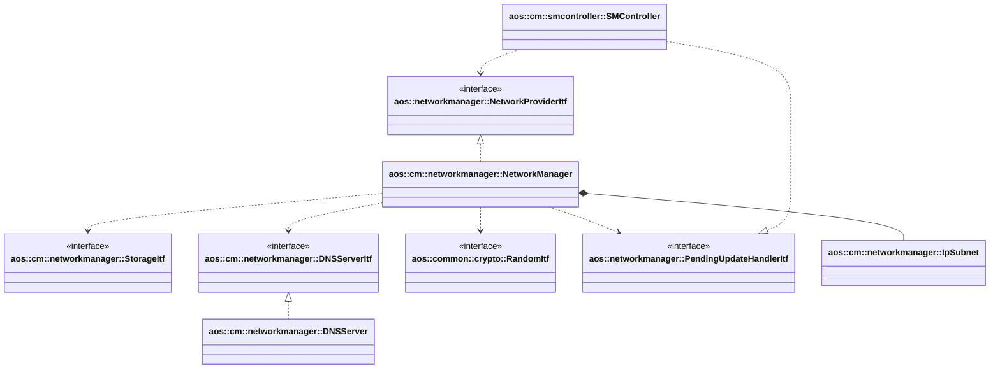
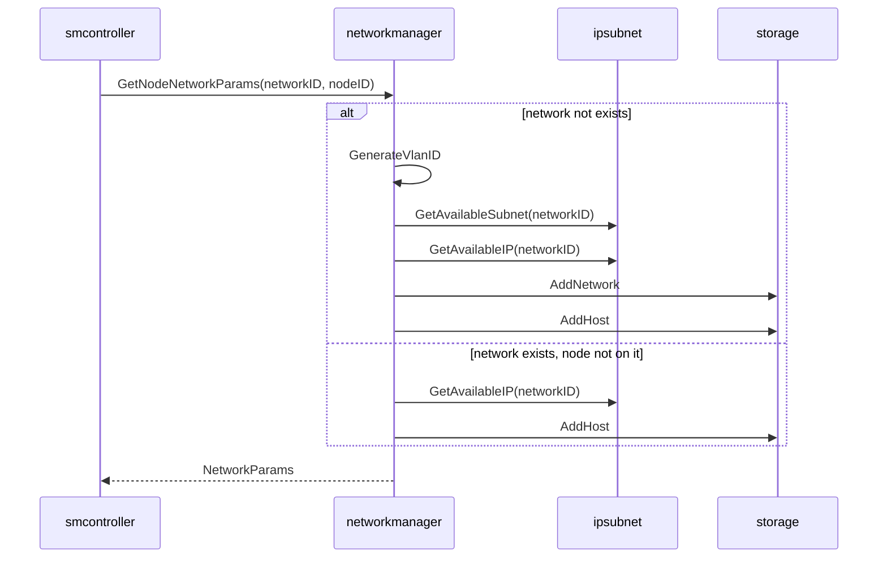
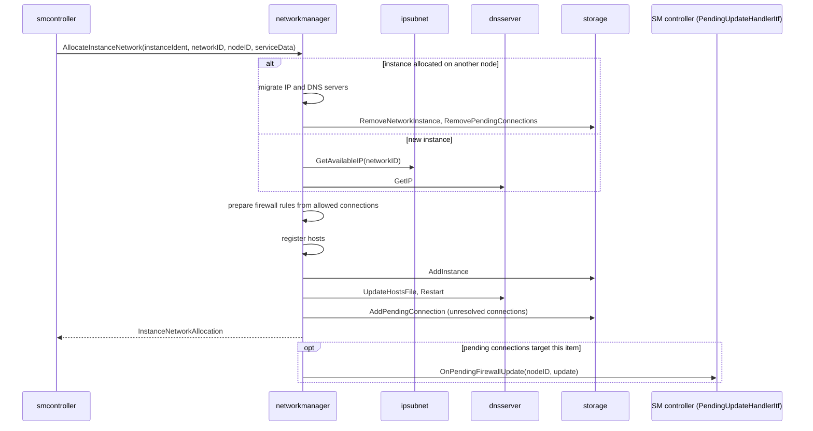
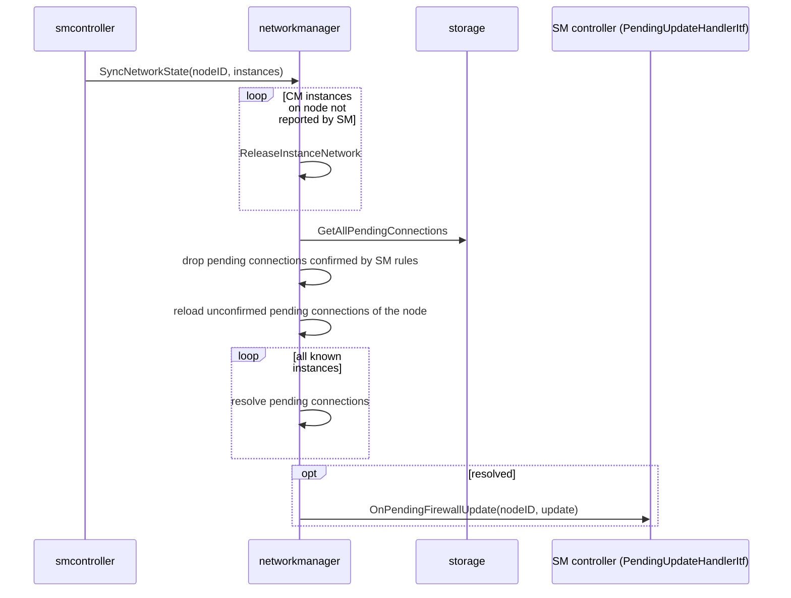

# Network manager

Network manager is the CM side of the AosCore networking. It is the allocator: it hands out subnets, VLAN IDs and IP
addresses to nodes and instances, resolves per-instance firewall rules from allowed connections and exposed ports,
maintains the unit-level DNS hosts and keeps the allocation consistent across the unit. The node side (namespaces,
bridges, firewall, bandwidth, DNS on the node) is built by the SM network manager.

The overall networking architecture is described in the public documentation:

- [Networking overview][arch-overview];
- [Per-instance network lifecycle][arch-lifecycle].

The contract between SM and CM is described in the core library [common network manager][common-networkmanager].
This document only covers the CM implementation of that contract.

[arch-overview]: https://github.com/aosedge/public-docs/blob/main/docs/aos-core/14-network/index.md
[arch-lifecycle]: https://github.com/aosedge/public-docs/blob/main/docs/aos-core/14-network/per-instance-networking.md
[common-networkmanager]: https://github.com/aosedge/aos_core_lib_cpp/blob/develop/src/core/common/networkmanager/networkmanager.md

It implements the following interfaces:

- [aos::networkmanager::NetworkProviderItf][networkprovider-itf] - serves node/instance network allocation, release
  and state synchronization requests coming from SM. SM controller exposes it to the nodes over the gRPC network
  service.

It requires the following interfaces:

- [aos::cm::networkmanager::StorageItf](itf/storage.hpp) - persistently stores networks, hosts, instances and pending
  connections;
- [aos::cm::networkmanager::DNSServerItf](itf/dnsserver.hpp) - unit-level DNS server (hosts file update, reload,
  DNS IP);
- [aos::common::crypto::RandomItf][random-itf] - generates VLAN IDs;
- [aos::networkmanager::PendingUpdateHandlerItf][pendingupdatehandler-itf] - optional; receives resolved pending
  firewall rules to push them to the node. In CM it is implemented by SM controller.

It uses the following internal components:

- [aos::cm::networkmanager::IpSubnet](ipsubnet.hpp) - subnet and IP allocator over predefined private network pools;
- [aos::cm::networkmanager::DNSServer](dnsserver.hpp) - `DNSServerItf` implementation over a dnsmasq process.

[networkprovider-itf]: https://github.com/aosedge/aos_core_lib_cpp/blob/develop/src/core/common/networkmanager/itf/networkprovider.hpp
[pendingupdatehandler-itf]: https://github.com/aosedge/aos_core_lib_cpp/blob/develop/src/core/common/networkmanager/itf/pendingupdatehandler.hpp
[random-itf]: https://github.com/aosedge/aos_core_lib_cpp/blob/develop/src/core/common/crypto/itf/rand.hpp

```mermaid
classDiagram
    direction TB

    class SMController ["aos::cm::smcontroller::SMController"] {
    }

    class NetworkProviderItf ["aos::networkmanager::NetworkProviderItf"] {
        <<interface>>
    }

    class NetworkManager ["aos::cm::networkmanager::NetworkManager"] {
    }

    class StorageItf ["aos::cm::networkmanager::StorageItf"] {
        <<interface>>
    }
    class DNSServerItf ["aos::cm::networkmanager::DNSServerItf"] {
        <<interface>>
    }
    class RandomItf ["aos::common::crypto::RandomItf"] {
        <<interface>>
    }
    class PendingUpdateHandlerItf ["aos::networkmanager::PendingUpdateHandlerItf"] {
        <<interface>>
    }
    class IpSubnet ["aos::cm::networkmanager::IpSubnet"] {
    }

    class DNSServer ["aos::cm::networkmanager::DNSServer"] {
    }

    %% SM controller serves the gRPC network service and forwards it to network manager
    SMController ..> NetworkProviderItf
    NetworkProviderItf <|.. NetworkManager

    %% network manager dependencies
    NetworkManager ..> StorageItf
    NetworkManager ..> DNSServerItf
    NetworkManager ..> RandomItf
    NetworkManager ..> PendingUpdateHandlerItf
    NetworkManager *-- IpSubnet

    %% implementations
    DNSServerItf <|.. DNSServer
    SMController ..|> PendingUpdateHandlerItf
```

## Data model

Network manager keeps its state in memory and mirrors it to the storage:

- **network** (`Network`) - network ID, allocated subnet and VLAN ID. One per network ID in the unit;
- **host** (`Host`) - node ID and the IP allocated to the node on that network (used as the bridge IP on the node). One
  per network and node;
- **instance** (`Instance`) - instance identifier, node ID, network ID, allocated IP, exposed ports and DNS servers;
- **pending connection** (`PendingConnection`) - an allowed connection of an instance (requester) to an item that has
  no allocated instances yet: requester identifier, node, network, IP and subnet, target item ID, port and protocol;
- **hosts** - in-memory map instance IP to DNS names, written to the DNS server hosts file.

In memory the data is organized as network state per network ID: the network, and per node ID the host and its
instances.

## Initialization

`Init` stores the dependencies and:

1. initializes the subnet allocator with the predefined private network pools;
2. loads networks, hosts and instances from the storage and rebuilds the in-memory network states;
3. marks the loaded subnets and IPs as used in the subnet allocator, so they are not allocated again;
4. loads pending connections from the storage.

No DNS hosts are rebuilt at this stage: the DNS hosts file is rewritten on the next allocation or release.

## aos::networkmanager::NetworkProviderItf

### GetNodeNetworkParams

Returns node network parameters (network ID, subnet, node IP, VLAN ID) for the given network and node:

- if the network and the node host already exist, returns the stored parameters;
- if the network exists but the node is not on it yet, allocates a node IP from the network subnet and stores the
  host;
- if the network does not exist, generates a unique VLAN ID, allocates a free subnet from the pools, allocates a node
  IP and stores the network and the host.

```mermaid
sequenceDiagram
    participant smcontroller
    participant networkmanager
    participant ipsubnet
    participant storage

    smcontroller ->> networkmanager: GetNodeNetworkParams(networkID, nodeID)

    alt network not exists
        networkmanager ->> networkmanager: GenerateVlanID
        networkmanager ->> ipsubnet: GetAvailableSubnet(networkID)
        networkmanager ->> ipsubnet: GetAvailableIP(networkID)
        networkmanager ->> storage: AddNetwork
        networkmanager ->> storage: AddHost
    else network exists, node not on it
        networkmanager ->> ipsubnet: GetAvailableIP(networkID)
        networkmanager ->> storage: AddHost
    end

    networkmanager -->> smcontroller: NetworkParams
```

### AllocateInstanceNetwork

Allocates instance network for the given instance, network and node. The network and the node host must already exist
(`GetNodeNetworkParams` must be called first), otherwise `eRuntime` is returned.

For a new instance:

1. if the same instance is currently allocated on another node, it is migrated: its IP and DNS servers are reused and
   the record on the other node is removed together with its pending connections;
2. otherwise a free IP is allocated from the network subnet and the CM DNS server IP is set as the instance DNS server;
3. exposed ports from the service data are parsed and stored with the instance;
4. firewall rules are prepared from allowed connections (see [Firewall rules](#firewall-rules));
5. the instance hosts are registered in the DNS hosts map. A host name that is already used by another instance
   fails the allocation with `eAlreadyExist`;
6. the instance is stored in the storage and the DNS server is reloaded;
7. unresolved allowed connections are stored as pending connections;
8. pending connections that target this instance item are resolved and pushed to the requesting nodes (see
   [Deferred firewall rules](#deferred-firewall-rules)).

For an already allocated instance (repeated call, e.g. SM restarted and re-created the instance), the stored IP and
DNS servers are returned and the firewall rules, hosts and pending connections are recomputed from the new service
data.

On any failure the allocated IP, the instance record and the hosts map are rolled back.

```mermaid
sequenceDiagram
    participant smcontroller
    participant networkmanager
    participant ipsubnet
    participant dnsserver
    participant storage
    participant pendinghandler as SM controller (PendingUpdateHandlerItf)

    smcontroller ->> networkmanager: AllocateInstanceNetwork(instanceIdent, networkID, nodeID, serviceData)

    alt instance allocated on another node
        networkmanager ->> networkmanager: migrate IP and DNS servers
        networkmanager ->> storage: RemoveNetworkInstance, RemovePendingConnections
    else new instance
        networkmanager ->> ipsubnet: GetAvailableIP(networkID)
        networkmanager ->> dnsserver: GetIP
    end

    networkmanager ->> networkmanager: prepare firewall rules from allowed connections
    networkmanager ->> networkmanager: register hosts
    networkmanager ->> storage: AddInstance
    networkmanager ->> dnsserver: UpdateHostsFile, Restart
    networkmanager ->> storage: AddPendingConnection (unresolved connections)

    networkmanager -->> smcontroller: InstanceNetworkAllocation

    opt pending connections target this item
        networkmanager ->> pendinghandler: OnPendingFirewallUpdate(nodeID, update)
    end
```

### ReleaseInstanceNetwork

Releases the instance on the given node: returns the IP to the subnet, removes the instance hosts from the DNS hosts
map, removes the instance and its pending connections (where it is the requester) from the storage and reloads the DNS
server. Unknown instances are ignored.

### ReleaseNodeNetwork

Releases the node from the network: releases all instances of the node on that network the same way as
`ReleaseInstanceNetwork`, removes the host from the storage and, if it was the last node on the network, returns the
subnet to the pool and removes the network from the storage. The DNS server is reloaded afterwards.

### SyncNetworkState

Reconciles the CM view with the running instances reported by SM on (re)connect:

1. instances that CM has allocated on the node but SM does not report are released (`ReleaseInstanceNetwork`);
2. pending connections of the node whose resolved rule is already present in the reported SM firewall rules are
   removed: the node has confirmed it applied the deferred update;
3. pending connections of the node are reloaded from the storage into memory, so updates that were pushed but not
   confirmed are re-sent;
4. pending connections are resolved again for all known instances and the resulting updates are pushed to the nodes.

```mermaid
sequenceDiagram
    participant smcontroller
    participant networkmanager
    participant storage
    participant pendinghandler as SM controller (PendingUpdateHandlerItf)

    smcontroller ->> networkmanager: SyncNetworkState(nodeID, instances)

    loop CM instances on node not reported by SM
        networkmanager ->> networkmanager: ReleaseInstanceNetwork
    end

    networkmanager ->> storage: GetAllPendingConnections
    networkmanager ->> networkmanager: drop pending connections confirmed by SM rules
    networkmanager ->> networkmanager: reload unconfirmed pending connections of the node

    loop all known instances
        networkmanager ->> networkmanager: resolve pending connections
    end

    opt resolved
        networkmanager ->> pendinghandler: OnPendingFirewallUpdate(nodeID, update)
    end
```

## Firewall rules

Allowed connections are given in the service data as `<itemID>/<port>[/<protocol>]` (protocol defaults to `tcp`, port
may be a range). Exposed ports are given as `<port>[/<protocol>]`.

For each allowed connection network manager looks up the allocated instances of the target item:

- if the target instance is in the same subnet as the requester, no rule is needed: instances on the same network
  communicate without restrictions;
- if the target instance exposes the requested port and protocol, a `FirewallRule` (destination IP and port, protocol,
  source IP) is added to the allocation result;
- if no instance of the target item is allocated at all, the connection is stored as pending.

## Deferred firewall rules

A pending connection is a connection whose target item had no allocated instance at allocation time. Pending
connections are kept in memory (keyed by target item ID) and in the storage.

When an instance of the target item is allocated (`AllocateInstanceNetwork`), the pending connections for that item
are resolved: for every pending connection with a matching exposed port a `FirewallRule` is built, the rules are
grouped per requester instance into `PendingFirewallUpdate` and pushed via `PendingUpdateHandlerItf` to the node
where the requester runs. SM controller forwards the update to the node over the network update stream.

A resolved pending connection is removed from memory only. It stays in the storage until SM confirms via
`SyncNetworkState` that the rule is applied on the node. This way an update that was lost (node was offline, stream
was down) is re-sent on the next (re)connect.

Pending connections of an instance are dropped when the instance is released, migrated to another node or
re-allocated.

## Network pools

Subnets are allocated from predefined private pools defined in [netpool.cpp](netpool.cpp): base networks
`172.17.0.0/16`, `172.18.0.0/16`, `172.19.0.0/16`, `172.20.0.0/14`, `172.24.0.0/14` and `172.28.0.0/14` are split into
`/16` subnets. When a subnet is requested for a new network, the allocator takes the first pool subnet that does not
overlap with any route on the CM host. The node and instance IPs are taken sequentially from the subnet.

## aos::cm::networkmanager::IpSubnet

- `Init` - loads the predefined pools;
- `GetAvailableSubnet(networkID)` - returns the subnet of the network, allocating a free one on the first call;
- `GetAvailableIP(networkID)` - returns the next free IP of the network subnet;
- `ReleaseIPToSubnet(networkID, ip)` - returns the IP back to the network subnet;
- `ReleaseIPNetPool(networkID)` - returns the network subnet back to the pools;
- `RemoveAllocatedSubnet(networkID, subnet, IPs)` - marks a subnet and its IPs loaded from the storage as used.

## aos::cm::networkmanager::DNSServerItf

CM runs a single unit-level dnsmasq that serves instance host names to all nodes. Network manager keeps the instance
IP to names map and writes it to the dnsmasq additional hosts file.

- `UpdateHostsFile(hosts)` - rewrites the `addnhosts` file in the DNS storage directory with the IP to names mapping;
- `Restart` - reads the dnsmasq PID from the PID file and sends `SIGHUP`, so dnsmasq reloads the hosts file without
  restarting;
- `GetIP` - returns the DNS server IP, which is handed to instances as their DNS server.

The DNS storage path, PID file and IP are taken from the CM config.
