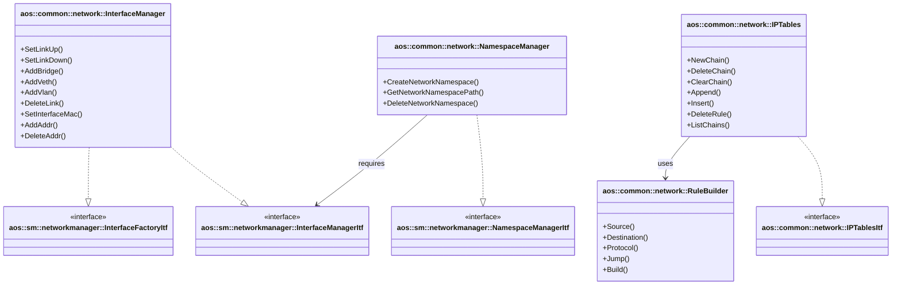

# Network utilities (Platform-specific implementation)

The common network module provides platform-specific implementations for low-level network operations. These utilities
work directly with Linux networking primitives: netlink, network namespaces, and iptables.

This is a platform-specific implementation that provides:

- Network interface management via netlink
- Network namespace operations
- iptables rule management
- Network utility functions

It implements the following interfaces:

- [aos::sm::networkmanager::InterfaceManagerItf][interfacemanager-itf] — network interface operations;
- [aos::sm::networkmanager::NamespaceManagerItf][namespacemanager-itf] — network namespace management;
- [aos::common::network::IPTablesItf][iptables-itf] — iptables operations;

It requires the following interfaces:

- [aos::common::crypto::RandomItf][random-itf] — randomness source for MAC address generation;



## Platform-specific components

### InterfaceManager

The InterfaceManager provides network interface operations using Linux netlink API.

#### InterfaceManager initialization

During initialization (`Init`):

- receives `RandomItf` for MAC address generation
- initializes netlink socket for communication with kernel

#### InterfaceManager responsibilities

- **Link operations**:
  - `SetLinkUp()` / `SetLinkDown()` — enable/disable network interfaces
  - `DeleteLink()` — remove network interfaces
  - `AddLink()` — add generic network links
  - `SetInterfaceMac()` — set MAC address for interface

- **Bridge operations**:
  - `AddBridge()` — create bridge interface
  - `CreateBridge()` — create and configure bridge

- **VETH operations**:
  - `AddVeth()` — create veth pair
  - `CreateVeth()` — create and configure veth pair with peer

- **VLAN operations**:
  - `AddVlan()` — create VLAN interface
  - `CreateVlan()` — create VLAN on existing interface

- **Address operations**:
  - `AddAddr()` — add IP address to interface
  - `DeleteAddr()` — remove IP address from interface

- **Namespace operations**:
  - `SetLinkNsByPid()` — move interface to network namespace by PID
  - `SetLinkNsFd()` — move interface to network namespace by file descriptor

#### InterfaceManager platform-specific implementation

InterfaceManager relies on Linux netlink:

- Uses `libnl3` library for netlink communication
- Operates on `rtnl_link` objects for link manipulation
- Supports AF_INET (IPv4) address family
- Requires CAP_NET_ADMIN capability for most operations

Link types supported:

- **Bridge** — software bridge for connecting interfaces
- **VETH** — virtual Ethernet pairs for namespace connectivity
- **VLAN** — 802.1Q VLAN interfaces

### NamespaceManager

The NamespaceManager provides network namespace management using Linux namespace API.

#### NamespaceManager initialization

During initialization (`Init`):

- receives `InterfaceManagerItf` for interface operations within namespaces
- ensures `/run/netns` directory exists for namespace persistence

#### NamespaceManager responsibilities

- **CreateNetworkNamespace** — creates new network namespace:
  - creates namespace mount point in `/run/netns/<name>`
  - binds process network namespace to mount point
  - ensures namespace persistence beyond process lifetime

- **GetNetworkNamespacePath** — returns path to namespace file descriptor

- **DeleteNetworkNamespace** — removes network namespace:
  - unmounts namespace file
  - removes mount point from `/run/netns`

#### NamespaceManager platform-specific implementation

Network namespaces rely on Linux kernel features:

- Uses `/proc/<pid>/task/<tid>/ns/net` for namespace access
- Requires `/run/netns` directory for namespace persistence
- Uses `mount --bind` for namespace mounting
- Requires CAP_SYS_ADMIN for namespace operations

### IPTables

The IPTables class provides iptables rule management using command-line tool.

#### IPTables initialization

During construction:

- receives table name (default: "filter")
- initializes mutex for thread-safe operations

#### IPTables responsibilities

- **Chain operations**:
  - `NewChain()` — create custom chain
  - `DeleteChain()` — remove custom chain
  - `ClearChain()` — flush all rules from chain
  - `ListChains()` — list all chains in table

- **Rule operations**:
  - `Append()` — add rule to end of chain
  - `Insert()` — insert rule at specific position
  - `DeleteRule()` — remove rule from chain
  - `ListAllRulesWithCounters()` — list rules with packet/byte counters

- **RuleBuilder** — fluent API for building iptables rules:
  - `Source()` — set source IP/subnet
  - `Destination()` — set destination IP/subnet
  - `Protocol()` — set protocol (tcp, udp, icmp)
  - `SourcePort()` / `DestinationPort()` — set port numbers
  - `Jump()` — set target (ACCEPT, DROP, RETURN, chain name)
  - `Build()` — construct rule string

#### IPTables platform-specific implementation

IPTables relies on Linux iptables command-line tool:

- Executes `iptables` commands via shell
- Parses text output for chain lists and counters
- Thread-safe with mutex protection
- Supports filter, nat, mangle, raw tables
- Requires `iptables` binary in system PATH
- Requires CAP_NET_ADMIN for rule modifications

Example rule building:

```cpp
auto rule = iptables.CreateRule()
    .Source("172.17.0.0/16")
    .Destination("0.0.0.0/0")
    .Protocol("tcp")
    .DestinationPort(443)
    .Jump("ACCEPT");
iptables.Append("FORWARD", rule);
```

### Network utilities

Additional utility functions in `utils.hpp`:

- **RandomMACAddress()** — generates random MAC address with local/unicast bits set
- **MaskToCIDR()** — converts netmask to CIDR prefix length
- **CIDRToMask()** — converts CIDR prefix to netmask string

[interfacemanager-itf]: https://github.com/aosedge/aos_core_lib_cpp/tree/main/src/core/sm/networkmanager/itf/
[namespacemanager-itf]: https://github.com/aosedge/aos_core_lib_cpp/tree/main/src/core/sm/networkmanager/itf/
[iptables-itf]: https://github.com/aosedge/aos_core_cpp/tree/main/src/common/network/itf/iptables.hpp
[random-itf]: https://github.com/aosedge/aos_core_lib_cpp/tree/main/src/core/common/crypto/itf/rand.hpp
