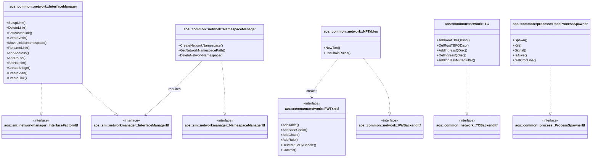
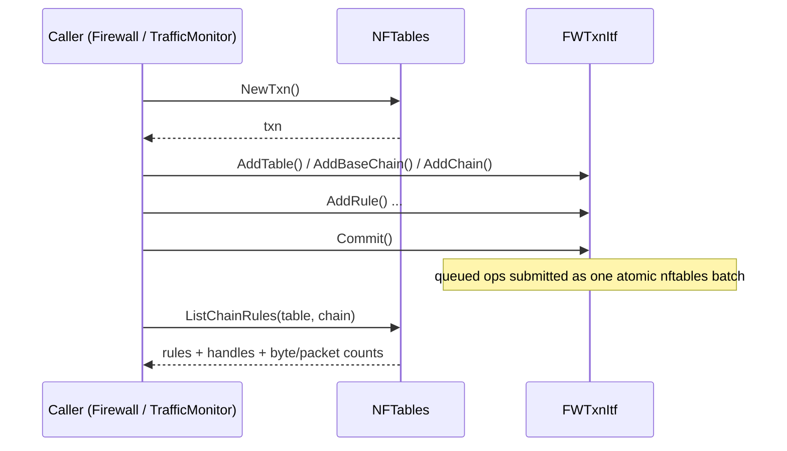

# Network utilities (Platform-specific implementation)

The common network module provides platform-specific implementations of the
low-level building blocks the Service Manager network stack is built on. They
work directly with Linux networking primitives: netlink links and addresses,
network namespaces, nftables, and the tc traffic-control subsystem. Process
spawning (used to run dnsmasq) lives next door in `src/common/process`.

This is a platform-specific implementation that provides:

- Network interface and link management via netlink (`libnl3`)
- Network namespace lifecycle
- An nftables firewall backend via `libnftables`
- A tc traffic-control backend via `libnl` (TBF / ingress / mirred)
- Network utility functions

It implements the following interfaces:

- [aos::sm::networkmanager::InterfaceManagerItf][interfacemanager-itf] — link / address / route / netns-move operations;
- [aos::sm::networkmanager::InterfaceFactoryItf][interfacefactory-itf] — link creation (bridge / vlan / generic link);
- [aos::sm::networkmanager::NamespaceManagerItf][namespacemanager-itf] — network namespace management;
- [aos::common::network::FWBackendItf][fwbackend-itf] — transactional nftables firewall backend;
- [aos::common::network::TCBackendItf][tcbackend-itf] — tc qdisc / filter backend;
- [aos::common::process::ProcessSpawnerItf][processspawner-itf] — process spawn / signal / reap.

It requires the following interfaces:

- [aos::common::crypto::RandomItf][random-itf] — randomness source for MAC address generation;

```mermaid
classDiagram
    class InterfaceManager["aos::common::network::InterfaceManager"] {
        +SetupLink()
        +DeleteLink()
        +SetMasterLink()
        +CreateVeth()
        +MoveLinkToNamespace()
        +RenameLink()
        +AddAddress()
        +AddRoute()
        +SetHairpin()
        +CreateBridge()
        +CreateVlan()
        +CreateLink()
    }

    class InterfaceManagerItf["aos::sm::networkmanager::InterfaceManagerItf"] {
        <<interface>>
    }

    class InterfaceFactoryItf["aos::sm::networkmanager::InterfaceFactoryItf"] {
        <<interface>>
    }

    class NamespaceManager["aos::common::network::NamespaceManager"] {
        +CreateNetworkNamespace()
        +GetNetworkNamespacePath()
        +DeleteNetworkNamespace()
    }

    class NamespaceManagerItf["aos::sm::networkmanager::NamespaceManagerItf"] {
        <<interface>>
    }

    class NFTables["aos::common::network::NFTables"] {
        +NewTxn()
        +ListChainRules()
    }

    class FWBackendItf["aos::common::network::FWBackendItf"] {
        <<interface>>
    }

    class FWTxnItf["aos::common::network::FWTxnItf"] {
        <<interface>>
        +AddTable()
        +AddBaseChain()
        +AddChain()
        +AddRule()
        +DeleteRuleByHandle()
        +Commit()
    }

    class TC["aos::common::network::TC"] {
        +AddRootTBFQDisc()
        +DelRootTBFQDisc()
        +AddIngressQDisc()
        +DelIngressQDisc()
        +AddIngressMirredFilter()
    }

    class TCBackendItf["aos::common::network::TCBackendItf"] {
        <<interface>>
    }

    class PocoProcessSpawner["aos::common::process::PocoProcessSpawner"] {
        +Spawn()
        +Kill()
        +Signal()
        +IsAlive()
        +GetCmdLine()
    }

    class ProcessSpawnerItf["aos::common::process::ProcessSpawnerItf"] {
        <<interface>>
    }

    InterfaceManager ..|> InterfaceManagerItf
    InterfaceManager ..|> InterfaceFactoryItf
    NamespaceManager ..|> NamespaceManagerItf
    NamespaceManager --> InterfaceManagerItf : requires
    NFTables ..|> FWBackendItf
    NFTables ..> FWTxnItf : creates
    TC ..|> TCBackendItf
    PocoProcessSpawner ..|> ProcessSpawnerItf
```

> **History:** earlier revisions of this module shipped an `IPTables` command
> wrapper (with a `RuleBuilder`) as the firewall / traffic-accounting backend.
> It has been removed — `NFTables` (firewall + traffic counters) and `TC`
> (bandwidth) replace it.

## Platform-specific components

### InterfaceManager

The InterfaceManager provides link, address, route and namespace operations
over the Linux netlink API, and doubles as the interface factory.

#### InterfaceManager initialization

During initialization (`Init`):

- receives `RandomItf` for MAC address generation
- opens an `rtnetlink` socket for communication with the kernel

#### InterfaceManager responsibilities

- **Link lifecycle (`InterfaceManagerItf`)**:
  - `SetupLink()` — bring an interface up
  - `DeleteLink()` — remove an interface
  - `SetMasterLink()` — enslave an interface to a bridge
  - `CreateVeth()` — create a veth pair (both ends in the current netns); the
    peer is given a unique transient name and renamed after the move
  - `MoveLinkToNamespace()` — move a link into a network namespace
  - `RenameLink()` — rename a (down) link, optionally inside a netns
  - `SetHairpin()` — toggle hairpin mode on a bridge port via sysfs

- **Link creation (`InterfaceFactoryItf`)**:
  - `CreateBridge()` — create and address a bridge
  - `CreateVlan()` — create an 802.1Q VLAN interface
  - `CreateLink()` — create a parameter-less link of a given kind (e.g. `ifb`)

- **Address / route operations**:
  - `AddAddress()` / `AddRoute()` — assign a CIDR address / add a route,
    optionally inside a netns
  - `AddAddr()` / `DeleteAddr()` / `GetAddrList()` — lower-level address helpers

#### InterfaceManager platform-specific implementation

InterfaceManager relies on Linux netlink:

- Uses `libnl3` for netlink communication
- Operates on `rtnl_link` objects for link manipulation
- Supports the AF_INET (IPv4) address family
- Requires CAP_NET_ADMIN for most operations

Link types created: **bridge**, **veth** pairs, **VLAN** interfaces, and
generic links such as **ifb** (used by the bandwidth shaper).

### NamespaceManager

The NamespaceManager provides network namespace management using the Linux
namespace API.

#### NamespaceManager initialization

During initialization (`Init`):

- receives `InterfaceManagerItf` for interface operations within namespaces
- ensures the `/run/netns` directory exists for namespace persistence

#### NamespaceManager responsibilities

- **CreateNetworkNamespace** — creates a new network namespace:
  - creates the mount point in `/run/netns/<name>`
  - bind-mounts the process network namespace to it
  - ensures the namespace persists beyond the creating process

- **GetNetworkNamespacePath** — returns the path to the namespace file

- **DeleteNetworkNamespace** — unmounts and removes the namespace file

#### NamespaceManager platform-specific implementation

Network namespaces rely on Linux kernel features:

- Uses `/proc/<pid>/task/<tid>/ns/net` for namespace access
- Requires the `/run/netns` directory for namespace persistence
- Uses `mount --bind` for namespace mounting
- Requires CAP_SYS_ADMIN for namespace operations

### NFTables

NFTables is the `FWBackendItf` implementation backed by `libnftables`. It is
the single firewall/packet-accounting backend, shared by the Service Manager
`Firewall` (table `inet aos`) and `TrafficMonitor` (table `inet aos-traffic`);
an internal mutex serializes concurrent use.

#### NFTables construction

During construction:

- receives the nftables address family (default: `inet`)
- initializes a mutex for thread-safe access

#### NFTables responsibilities

- **NewTxn** — opens a `FWTxnItf` atomic transaction. Operations are queued in
  the transaction object and submitted as a single batch on `Commit()`;
  dropping the transaction without committing discards every queued operation.
  A transaction can:
  - `AddTable()` / `DeleteTable()`
  - `AddBaseChain()` (anchored to a netfilter hook with a priority) /
    `AddChain()` (regular jump-only chain)
  - `FlushChain()` / `DeleteChain()`
  - `AddRule()` — append a rule (src/dst/proto/port/oif match, verdict,
    optional `counter` and `ct state` expressions)
  - `DeleteRuleByHandle()` — delete a rule by the handle returned from a listing

- **ListChainRules** — lists a chain's rules with their handles and, when the
  rule carries a `counter` expression, byte/packet counts (used by
  TrafficMonitor to read per-instance traffic).

A typical transaction (e.g. a `Firewall` adding an instance chain) batches its
operations and commits them atomically; counters are read separately:

```mermaid
sequenceDiagram
    participant C as Caller (Firewall / TrafficMonitor)
    participant NFT as NFTables
    participant Txn as FWTxnItf

    C->>NFT: NewTxn()
    NFT-->>C: txn
    C->>Txn: AddTable() / AddBaseChain() / AddChain()
    C->>Txn: AddRule() ...
    C->>Txn: Commit()
    Note over Txn: queued ops submitted as one atomic nftables batch
    C->>NFT: ListChainRules(table, chain)
    NFT-->>C: rules + handles + byte/packet counts
```

#### NFTables platform-specific implementation

- Drives `libnftables` via its buffer command interface
- Builds rules from the `FWRule` / `FWBaseChain` / `FWChain` structs
- Atomic per-transaction commit; thread-safe with mutex protection
- Requires CAP_NET_ADMIN for table/chain/rule modifications

### TC

TC is the `TCBackendItf` implementation over the Linux tc subsystem (`libnl`
traffic-control). It is a narrow, stateless surface: each call opens a
short-lived rtnetlink socket, with no background threads or long-lived kernel
handles. IFB device lifecycle lives in InterfaceFactoryItf / InterfaceManagerItf.

#### TC responsibilities

- `AddRootTBFQDisc()` / `DelRootTBFQDisc()` — install / remove a Token-Bucket-
  Filter root qdisc (delete only removes a TBF qdisc, leaving anything else
  untouched)
- `AddIngressQDisc()` / `DelIngressQDisc()` — add / remove the ingress qdisc
- `AddIngressMirredFilter()` — install a matchall classifier whose mirred
  action redirects every ingress packet to another interface's egress (used to
  shape the container's egress via an IFB device)

#### TC platform-specific implementation

- Uses `libnl` (`libnl-route-3`) rtnetlink for qdisc / filter manipulation
- Delete operations are best-effort and idempotent (eNone when nothing to remove)
- Requires CAP_NET_ADMIN

### PocoProcessSpawner

PocoProcessSpawner (in `src/common/process`) is the `ProcessSpawnerItf`
implementation used to manage the per-network `dnsmasq` processes. `Spawn` uses
`Poco::Process::launch`; `Signal` / `Kill` use `::kill` plus `::waitpid` for the
reap. `Kill` tolerates `ESRCH` (already gone) and `ECHILD` (adopted from a
previous lifetime), so teardown is idempotent across SM restarts.

- `Spawn()` — launch a binary, returning its PID
- `Kill()` — terminate and reap a process
- `Signal()` — send a signal (e.g. SIGHUP to reload dnsmasq hosts)
- `IsAlive()` — check whether a PID is still running
- `GetCmdLine()` — read `/proc/<pid>/cmdline` (used to confirm an adopted PID
  is really a dnsmasq for the expected network)

### Network utilities

Additional utility functions in `utils.hpp`:

- **RandomMACAddress()** — generates a random MAC address with local/unicast bits set
- **MaskToCIDR()** — converts a netmask to a CIDR prefix length
- **CIDRToMask()** — converts a CIDR prefix to a netmask string

[interfacemanager-itf]: https://github.com/aosedge/aos_core_lib_cpp/tree/main/src/core/sm/networkmanager/itf/interfacemanager.hpp
[interfacefactory-itf]: https://github.com/aosedge/aos_core_lib_cpp/tree/main/src/core/sm/networkmanager/itf/interfacefactory.hpp
[namespacemanager-itf]: https://github.com/aosedge/aos_core_lib_cpp/tree/main/src/core/sm/networkmanager/itf/namespacemanager.hpp
[fwbackend-itf]: https://github.com/aosedge/aos_core_cpp/tree/main/src/common/network/itf/firewallbackend.hpp
[tcbackend-itf]: https://github.com/aosedge/aos_core_cpp/tree/main/src/common/network/itf/tcbackend.hpp
[processspawner-itf]: https://github.com/aosedge/aos_core_cpp/tree/main/src/common/process/itf/processspawner.hpp
[random-itf]: https://github.com/aosedge/aos_core_lib_cpp/tree/main/src/core/common/crypto/itf/rand.hpp
