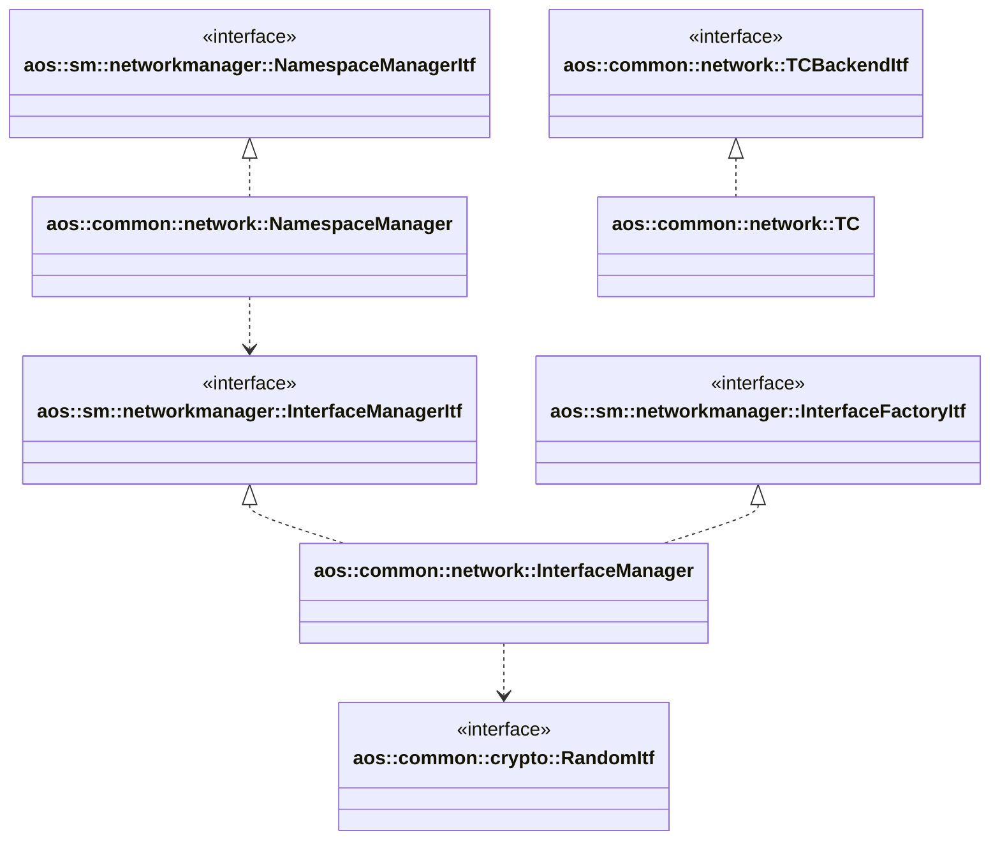

# Network (platform-specific implementation)

The common network module provides the low-level Linux building blocks the AosCore network stack is built on: netlink
link, address and route management, network namespaces, tc traffic control and netlink route utilities. It is used
by the SM network manager implementations (see [SM network manager](../../sm/networkmanager/networkmanager.md)) and
by the CM network manager subnet allocator (see [CM network manager](../../cm/networkmanager/networkmanager.md)).

The nftables backend lives in [sm/nftables](../../sm/nftables/nftables.hpp) and the process spawner used for dnsmasq
in [common/process](../process/processspawner.hpp); they are not part of this module.

It implements the following interfaces:

- [aos::sm::networkmanager::InterfaceManagerItf][interfacemanager-itf] and
  [aos::sm::networkmanager::InterfaceFactoryItf][interfacefactory-itf] - [InterfaceManager](interfacemanager.hpp):
  link, address, route and namespace-move operations plus bridge / VLAN / generic link creation;
- [aos::sm::networkmanager::NamespaceManagerItf][namespacemanager-itf] - [NamespaceManager](namespacemanager.hpp):
  network namespace lifecycle;
- [aos::common::network::TCBackendItf](itf/tcbackend.hpp) - [TC](tc.hpp): tc qdisc and filter backend.

It requires the following interfaces:

- [aos::common::crypto::RandomItf][random-itf] - randomness source for VLAN MAC address generation;
- [aos::sm::networkmanager::InterfaceManagerItf][interfacemanager-itf] - used by `NamespaceManager` to bring up the
  loopback interface inside a new namespace.

[interfacemanager-itf]: https://github.com/aosedge/aos_core_lib_cpp/blob/develop/src/core/sm/networkmanager/itf/interfacemanager.hpp
[interfacefactory-itf]: https://github.com/aosedge/aos_core_lib_cpp/blob/develop/src/core/sm/networkmanager/itf/interfacefactory.hpp
[namespacemanager-itf]: https://github.com/aosedge/aos_core_lib_cpp/blob/develop/src/core/sm/networkmanager/itf/namespacemanager.hpp
[random-itf]: https://github.com/aosedge/aos_core_lib_cpp/blob/develop/src/core/common/crypto/itf/rand.hpp

```mermaid
classDiagram
    direction TB

    class InterfaceManagerItf ["aos::sm::networkmanager::InterfaceManagerItf"] {
        <<interface>>
    }
    class InterfaceFactoryItf ["aos::sm::networkmanager::InterfaceFactoryItf"] {
        <<interface>>
    }
    class NamespaceManagerItf ["aos::sm::networkmanager::NamespaceManagerItf"] {
        <<interface>>
    }
    class TCBackendItf ["aos::common::network::TCBackendItf"] {
        <<interface>>
    }

    class InterfaceManager ["aos::common::network::InterfaceManager"] {
    }
    class NamespaceManager ["aos::common::network::NamespaceManager"] {
    }
    class TC ["aos::common::network::TC"] {
    }

    class RandomItf ["aos::common::crypto::RandomItf"] {
        <<interface>>
    }

    InterfaceManagerItf <|.. InterfaceManager
    InterfaceFactoryItf <|.. InterfaceManager
    NamespaceManagerItf <|.. NamespaceManager
    TCBackendItf <|.. TC

    InterfaceManager ..> RandomItf
    NamespaceManager ..> InterfaceManagerItf
```

## InterfaceManager

`InterfaceManager` talks to the kernel over rtnetlink using `libnl3` (`libnl-route-3`). Each call opens a short-lived
netlink socket; there is no long-lived state besides the random generator. Operations that take a `netNSPath` enter
the given network namespace with `setns` for the duration of the call and return to the original one afterwards.

Link creation (`InterfaceFactoryItf`):

- **CreateBridge** - creates a bridge, brings it up and assigns the given IP/subnet. Address assignment is idempotent;
- **CreateVlan** - creates an 802.1Q VLAN interface on top of the uplink interface (the one the default route points
  to) with a random locally administered MAC, optionally enslaved to a master bridge in the same netlink message, and
  brings it up;
- **CreateLink** - creates a parameter-less link of the given kind (e.g. `ifb`, `dummy`).

Link management (`InterfaceManagerItf`):

- **GetLink** - returns link attributes as seen on the system: kind (bridge, vlan, veth or unknown), master, VLAN ID
  and up state. Returns `eNotFound` if the link does not exist. Used by the library to adopt links left by a previous
  SM lifetime;
- **GetUplinkInterface** - returns the name of the interface the default route points to. Used for masquerade and as
  the VLAN parent;
- **DeleteLink** - deletes a link. Returns `eNotFound` if it does not exist;
- **SetupLink** - brings a link up, optionally inside a namespace. Required after a namespace move, since the kernel
  administratively downs a moved link;
- **SetMasterLink** - enslaves a link to a bridge;
- **CreateVeth** - creates a veth pair with both ends in the current namespace;
- **CreateVethToNamespace** - creates a veth pair with the peer created directly in the target namespace under its
  final name, and the host end already up and enslaved to the master bridge. Creation, move, rename, enslave and
  bring-up are one netlink operation;
- **ConfigureInstanceInterface** - inside the given namespace brings the link up, assigns the CIDR address and installs
  the default route via the gateway, entering the namespace once for all three steps;
- **MoveLinkToNamespace** - moves a link into a namespace given by its `/run/netns` path;
- **RenameLink** - renames a (down) link, optionally inside a namespace;
- **AddAddress** / **AddRoute** - assign a CIDR address / add a route, optionally inside a namespace;
- **SetHairpin** - toggles hairpin mode on a bridge port through sysfs (`/sys/class/net/<if>/brport/hairpin_mode`).

Lower-level helpers used by the above and available to other modules: `AddLink`, `AddAddr`, `DeleteAddr`,
`GetAddrList`.

Only the IPv4 address family is supported. Most operations require `CAP_NET_ADMIN`.

## NamespaceManager

`NamespaceManager` manages named network namespaces under `/run/netns`, compatible with `ip netns`.

- **Init** - stores the interface manager and ensures `/run/netns` exists;
- **CreateNetworkNamespace** - no-op if the namespace file already exists. Otherwise creates a new network namespace
  with `unshare(CLONE_NEWNET)` on the calling thread, bind-mounts the thread namespace to `/run/netns/<name>` so it
  persists, brings up `lo` inside it and switches the thread back to the original namespace;
- **IsNetworkNamespaceExist** - checks whether the namespace file exists;
- **GetNetworkNamespacePath** - returns `/run/netns/<name>`;
- **DeleteNetworkNamespace** - lazily unmounts (`MNT_DETACH`) and removes the namespace file. The kernel tears the
  namespace down together with the interfaces inside it once nothing references it. No-op if the file does not exist.

Requires `CAP_SYS_ADMIN`.

## TC

`TC` is the `TCBackendItf` implementation over the Linux traffic-control subsystem using `libnl-route-3`. It is
stateless: each call opens a short-lived rtnetlink socket. IFB device lifecycle is not handled here; it belongs to
`InterfaceFactoryItf` / `InterfaceManagerItf`.

- **AddRootTBFQDisc** - installs (or replaces) a Token Bucket Filter qdisc as the root qdisc of an interface with the
  given rate, burst and limit;
- **DelRootTBFQDisc** - deletes the root qdisc only if it is a TBF qdisc. Any other root qdisc is left untouched;
- **AddIngressQDisc** / **DelIngressQDisc** - add / delete the ingress qdisc of an interface;
- **AddIngressMirredFilter** - installs a `matchall` classifier on the ingress qdisc of the source interface with a
  `mirred` egress redirect action to the destination interface. Used to shape traffic leaving a container through an
  IFB device.

Delete operations are idempotent and return `eNone` when there is nothing to remove. Requires `CAP_NET_ADMIN`.

## Utilities

[utils.hpp](utils.hpp) provides netlink helpers shared by the module and by the CM subnet allocator:

- **CreateNetlinkSocket** - opens and connects an rtnetlink socket;
- **GetRouteList** - lists IPv4 routes (destination, gateway, link index). A route without destination is the
  default route;
- **CheckRouteOverlaps** - checks whether a CIDR network overlaps with any listed route. CM uses it to skip subnet
  pools already routed on the host;
- **NetworkContainsIP** - checks whether an IP belongs to a CIDR network;
- **ParseAddress** - parses a CIDR string into a netlink address;
- **NLToAosErr** / **NLToAosException** - convert a libnl error code into an AosCore error / exception.

## Platform requirements

- Linux with network namespaces and tc support;
- `libnl-3` and `libnl-route-3` at runtime;
- `/run/netns` writable for namespace persistence;
- `CAP_NET_ADMIN` for link, address, route and tc operations, `CAP_SYS_ADMIN` for namespaces.
