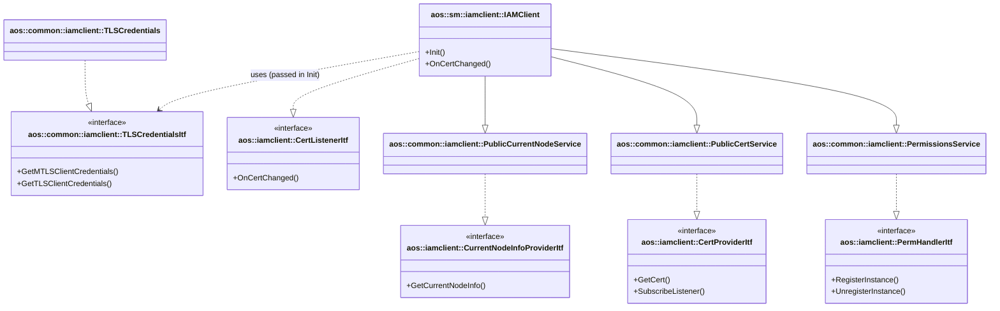

# IAM Client (Service Manager)

Provides access to IAM services through gRPC communication with IAM server for the Service Manager component.

## Overview

The `aos::sm::iamclient::IAMClient` class aggregates multiple gRPC service implementations to provide a unified
IAM client interface for the Service Manager. It implements specific interfaces required by SM components by inheriting
from gRPC service classes.

## Service inheritance pattern

`IAMClient` achieves interface compatibility through multiple inheritance from gRPC service implementations:

### Required interfaces for SM

The Service Manager requires:

* [aos::iamclient::PermHandlerItf][perm-handler-itf] - handles service instance permissions (register/unregister)
* [aos::iamclient::CertProviderItf][cert-provider-itf] - provides info about current keys and certificates
* [aos::iamclient::CurrentNodeInfoProviderItf][current-node-info-provider-itf] - provides current node information
* [aos::common::iamclient::TLSCredentialsItf][tls-credentials-itf] - provides TLS/mTLS credentials for gRPC connections

### Service implementation mapping

`IAMClient` inherits from the following gRPC service classes, which implement the required interfaces:

| gRPC Service Class | Implements Interface | Purpose |
|-------------------|---------------------|---------|
| [PermissionsService][perm-service] | `PermHandlerItf` | Protected Permissions Service |
| [PublicCertService][public-cert-service] | `CertProviderItf` | Public Certificate Service |
| [PublicCurrentNodeService][public-current-node-service] | `CurrentNodeInfoProviderItf` | Public Node Service |

### Additional interface

`IAMClient` also directly implements:

* [aos::iamclient::CertListenerItf][cert-listener-itf] - receives certificate change notifications

### TLS Credentials handling

Unlike the service classes, `TLSCredentials` is not inherited but **passed as a parameter** during
initialization. The `TLSCredentialsItf` reference is used by all gRPC services internally to establish secure
connections to the IAM server.

## Class diagram

## Certificate change handling

When a certificate changes, `IAMClient` receives notification via the `CertListenerItf::OnCertChanged()` callback
and automatically reconnects all gRPC services to the IAM server using the updated credentials:

1. Certificate change notification received
2. Reconnect `PermissionsService` to protected IAM server
3. Reconnect `PublicCertService` to public IAM server
4. Reconnect `PublicCurrentNodeService` to public IAM server

[perm-handler-itf]: https://github.com/aosedge/aos_core_lib_cpp/blob/main/src/core/common/iamclient/itf/permhandler.hpp
[cert-provider-itf]: https://github.com/aosedge/aos_core_lib_cpp/blob/main/src/core/common/iamclient/itf/certprovider.hpp
[current-node-info-provider-itf]: https://github.com/aosedge/aos_core_lib_cpp/blob/main/src/core/common/iamclient/itf/currentnodeinfoprovider.hpp
[tls-credentials-itf]: https://github.com/aosedge/aos_core_cpp/tree/feature_unification/src/common/iamclient/itf/tlscredentials.hpp
[cert-listener-itf]: https://github.com/aosedge/aos_core_lib_cpp/blob/main/src/core/common/iamclient/itf/certlistener.hpp
[perm-service]: https://github.com/aosedge/aos_core_cpp/tree/feature_unification/src/common/iamclient/permservice.hpp
[public-cert-service]: https://github.com/aosedge/aos_core_cpp/tree/feature_unification/src/common/iamclient/publiccertservice.hpp
[public-current-node-service]: https://github.com/aosedge/aos_core_cpp/tree/feature_unification/src/common/iamclient/publiccurrentnodeservice.hpp
