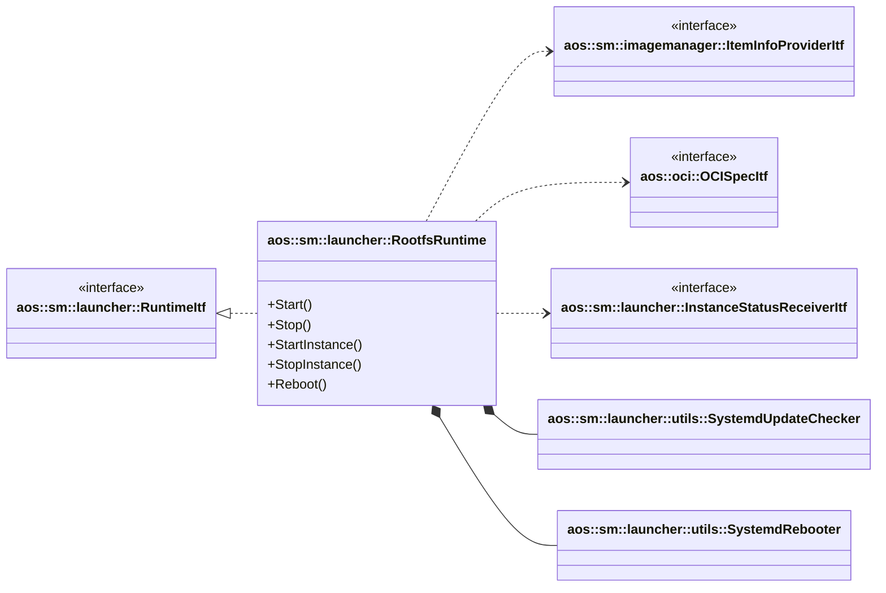
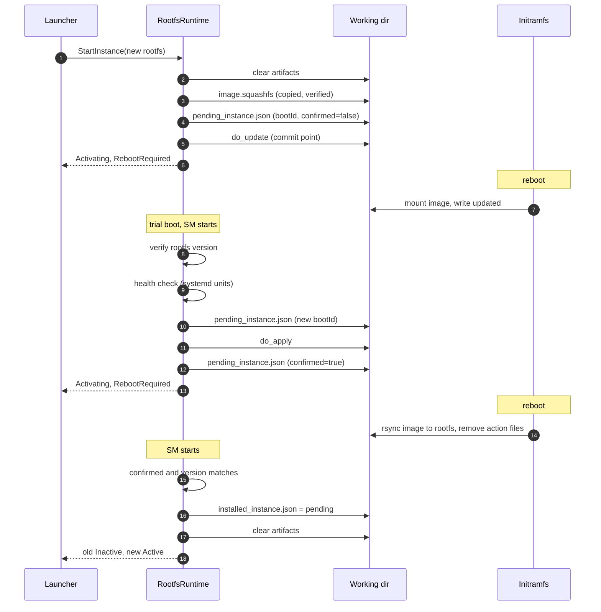
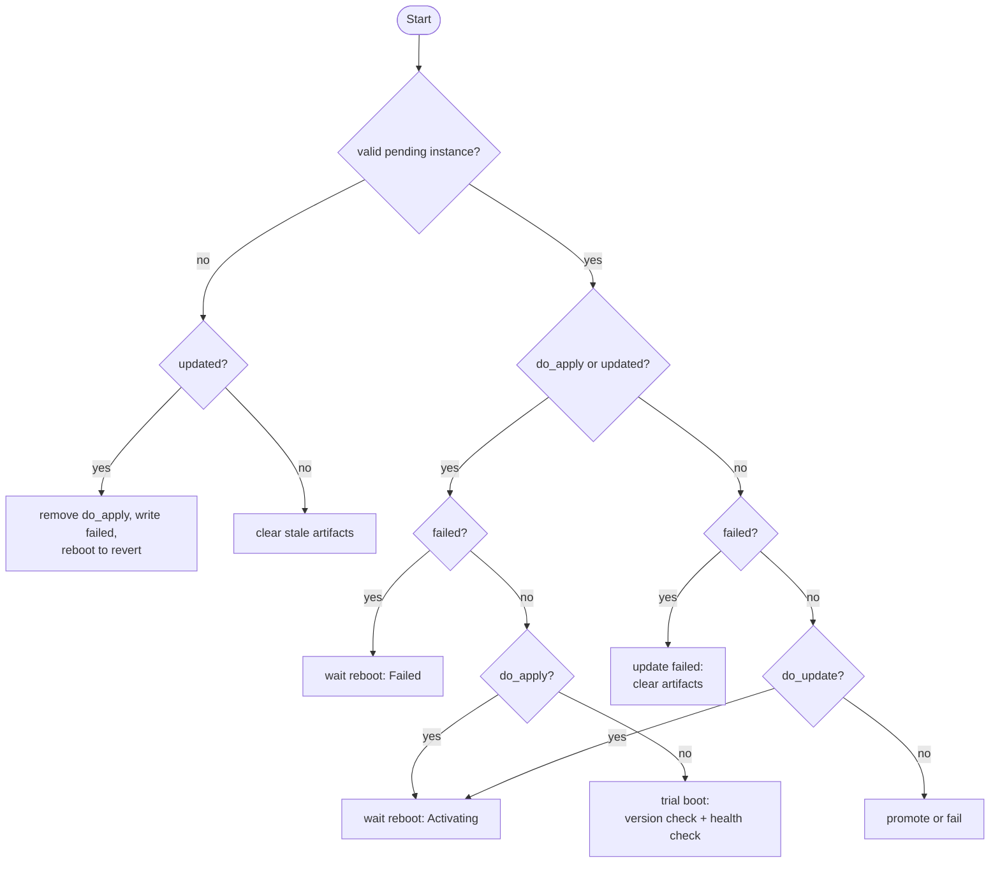

# Rootfs runtime

The rootfs runtime updates the node root filesystem. It is a component runtime with a single instance: the instance
represents the rootfs version that is currently running on the node. Starting a new instance means updating the rootfs.

The update itself is done by the initramfs [aosupdate][aosupdate] module on boot. The runtime prepares the update,
requests reboots, confirms or rejects the updated rootfs with a health check and reports instance statuses. SM and the
initramfs communicate through files in the runtime working directory.

The update must survive power loss and SM restarts at any moment. The main rules are:

- a not applied update is never reported as installed;
- a failed update is never applied or promoted;
- SM always starts, even if runtime state files are corrupted;
- every state change is durable before the next step depends on it.

[aosupdate]: https://github.com/aosedge/meta-aos/blob/develop/recipes-core/initrdscripts/initramfs-framework/aosupdate

## Overview

[RootfsRuntime](rootfs.hpp) implements [aos::sm::launcher::RuntimeItf][runtime-itf] and uses:

- [aos::sm::imagemanager::ItemInfoProviderItf][item-info-provider-itf] - provides paths of the installed image blobs;
- [aos::oci::OCISpecItf][oci-spec-itf] - loads the image manifest;
- [aos::sm::launcher::InstanceStatusReceiverItf][status-receiver-itf] - receives instance statuses and reboot requests;
- [aos::iamclient::CurrentNodeInfoProviderItf][node-info-provider-itf] - provides node info for the runtime info and the
  default instance ident;
- [SystemdUpdateChecker](../utils/systemdupdatechecker.hpp) - checks that the configured systemd units are active after
  the update;
- [SystemdRebooter](../utils/systemdrebooter.hpp) - reboots the node through systemd.

[runtime-itf]: https://github.com/aosedge/aos_core_lib_cpp/blob/develop/src/core/sm/launcher/itf/runtime.hpp
[item-info-provider-itf]: https://github.com/aosedge/aos_core_lib_cpp/blob/develop/src/core/sm/imagemanager/itf/iteminfoprovider.hpp
[oci-spec-itf]: https://github.com/aosedge/aos_core_lib_cpp/blob/develop/src/core/common/ocispec/itf/ocispec.hpp
[status-receiver-itf]: https://github.com/aosedge/aos_core_lib_cpp/blob/develop/src/core/sm/launcher/itf/instancestatusreceiver.hpp
[node-info-provider-itf]: https://github.com/aosedge/aos_core_lib_cpp/blob/develop/src/core/common/iamclient/itf/currentnodeinfoprovider.hpp



`StopInstance` only reports the instance as inactive: the rootfs can't be stopped. `InitInstances` does nothing and
`GetInstanceMonitoringData` is not supported.

## Configuration

The runtime is configured in the SM `runtimes` section:

```json
{
    "plugin": "rootfs",
    "type": "rootfs",
    "isComponent": true,
    "config": {
        "workingDir": "/var/aos/workdirs/sm/runtimes/rootfs",
        "versionFilePath": "/etc/aos/version",
        "healthCheckServices": ["aos-servicemanager.service", "aos-updatemanager.service"]
    }
}
```

| Parameter             | Default                                | Description                                         |
| --------------------- | -------------------------------------- | --------------------------------------------------- |
| `workingDir`          | `<SM working dir>/runtimes/rootfs`     | Update artifacts directory shared with initramfs.   |
| `versionFilePath`     | `/etc/aos/version`                     | Rootfs version file, format: `VERSION="<version>"`. |
| `healthCheckServices` | empty                                  | systemd units that must be active after the update. |

`workingDir` must be the directory that the initramfs uses as the update directory (`aosupdate.disk` and
`aosupdate.path` kernel parameters).

## Instance identity and version

The runtime has a single instance:

- **current instance** - the installed rootfs, stored in `installed_instance.json`. If the file doesn't exist (first
  start) or is corrupted, it is created from the version file with the default ident: item ID is the runtime type,
  subject ID is the node type, the instance is preinstalled.
- **pending instance** - the update in progress, stored in `pending_instance.json`.

The rootfs version file of the update image must contain the version of the update item. The version is used to check
that the node really runs the updated rootfs.

## Working directory

| File                      | Written by    | Description                                                             |
| ------------------------- | ------------- | ----------------------------------------------------------------------- |
| `installed_instance.json` | SM            | Current instance info.                                                  |
| `pending_instance.json`   | SM            | Pending instance info, boot ID and confirmed flag.                      |
| `image.squashfs`          | SM            | Update image copied from the image manager blob.                        |
| `do_update`               | SM            | Requests the update, contains the update type: `full` or `incremental`. |
| `updated`                 | initramfs     | Update image is mounted, the node runs the updated rootfs (trial boot). |
| `do_apply`                | SM            | Trial boot is confirmed, the update should be applied.                  |
| `failed`                  | SM, initramfs | Update failed, contains the failure reason.                             |
| `*.tmp`                   | SM            | Temporary files of atomic writes, never used by initramfs.              |

`pending_instance.json` format:

```json
{
    "itemId": "rootfs",
    "subjectId": "nodeType",
    "instance": 0,
    "manifestDigest": "sha256:...",
    "type": "component",
    "version": "1.0.1",
    "preinstalled": false,
    "bootId": "5b0f1c1a-...",
    "confirmed": false
}
```

- `bootId` - the boot ID (`/proc/sys/kernel/random/boot_id`) at the moment SM made the last update step. It is used to
  distinguish an SM restart within the same boot from a reboot.
- `confirmed` - set when the health check confirmed the update and `do_apply` is durable. A confirmed pending instance
  without action files means that initramfs applied the update.

`installed_instance.json` has the same format, `bootId` and `confirmed` are not used.

## Initramfs contract

The initramfs [aosupdate][aosupdate] module selects the action by action files in the following priority:

| Priority | Condition   | Action                                                                                     |
| -------- | ----------- | ------------------------------------------------------------------------------------------ |
| 1        | `do_apply`  | **apply**: rsync the image into the rootfs, remount it read-only, remove all action files. |
| 2        | `updated`   | **revert**: remove all action files and write `failed` with `update not confirmed`.        |
| 3        | `do_update` | **update**: mount the image as rootfs (full) or overlay (incremental), write `updated`.    |

Other details that the runtime relies on:

- `do_update` is not removed after the update, it is removed only by apply or revert;
- the image is found with `find -name "*.squashfs" | head -n1`, so only one image may exist in the working directory and
  temporary files must not match this pattern;
- on any error initramfs writes `failed` with the error message but keeps the other action files. If apply fails,
  `do_apply` remains and apply is retried on the next boot;
- empty `do_update` means a full update.

## Update flow



If the health check fails or the rootfs version doesn't match, SM removes `do_apply`, writes `failed` with the reason
and requests a reboot. The initramfs reverts the update on the next boot (no `do_apply`, `updated` exists), and SM
reports the update as failed and the current instance as active.

### Preparing the update

`StartInstance` returns the known status without any action if the instance is the current or the pending one:

- if the pending instance is failed, the update error is returned as well: the launcher treats a successful start as an
  active instance;
- if a reboot is still required (the pending update or a trial boot revert is waiting for it), the reboot request is
  sent again. The launcher skips duplicated requests.

Otherwise, the update is prepared:

1. Wait for the running health check: its verdict must be stored before update artifacts are replaced.
2. Clear all update artifacts. Preparation is aborted if a previous `do_update` can't be durably removed.
3. Load the image manifest and get the update type from the first layer media type. Supported media types:
   `[application/]vnd.aos.image.component.<full|inc>.v<N>[+<suffix>]`.
4. Copy the layer blob to `image.squashfs.tmp`, verify its size and sha256 digest against the manifest layer
   descriptor, fsync and rename it to `image.squashfs`.
5. Store `pending_instance.json` with the current boot ID and `confirmed=false`.
6. Store `do_update` with the update type. This is the commit point: initramfs starts the update only if `do_update`
   exists, and at this moment all other artifacts are durable.
7. Request a reboot.

If any preparation step fails, artifacts are cleared and the instance is reported as failed. Preparation also fails if
the boot ID can't be read. If only the reboot request fails, the prepared update is kept, the error is returned and the
request is sent again on the next `StartInstance` for this instance.

### Health check verdict

The verdict is stored in steps, each step is durable before the next one:

| Verdict  | Steps                                                                                   |
| -------- | --------------------------------------------------------------------------------------- |
| confirm  | `pending_instance.json` (new boot ID) -> `do_apply` -> `pending_instance.json` (confirmed) |
| reject   | `pending_instance.json` (new boot ID) -> remove `do_apply` -> `failed` (reason)            |

The confirmed flag is written only after `do_apply` is durable. Any interruption between the steps results in a failed
update or in an applied update that is still detected by the version change, but never in promotion of a not applied
update.

If storing the confirm verdict fails, the reject verdict is stored: without `do_apply` initramfs reverts the update
anyway. If the verdict can't be stored and `do_apply` may remain (it exists or the action files can't be read), the
update is reported as failed but the reboot is not requested: it would apply the update. The update state is processed
again on the next SM start.

The health check is started after `Start` sends its statuses, so the health check result is always received after them.
If the pending update is replaced before the verdict is stored, the verdict is discarded.

The health check waits until all configured systemd units are active or any of them failed, with retries (5 attempts,
10 seconds to 1 minute delay).

## Start processing

On `Start`, the runtime loads the current and pending instances, reads all action files and decides what to do. Lookup
errors of the state files are returned as errors and are never treated as missing files: a wrong decision may overwrite
the installed instance or promote an unconfirmed update.



### No valid pending instance

The update can't be tracked, so it is canceled:

- `updated` exists (trial boot): remove `do_apply`, write `failed` and request a reboot, so initramfs reverts the
  update. If `do_apply` can't be durably removed, the reboot is not requested (initramfs would apply the untracked
  update), the error is reported in the current instance status and removal is retried on the next start;
- otherwise: clear stale artifacts (images, temporary files, action files).

The current instance is reported as active.

### Waiting for reboot

`do_update`, `do_apply`, or `updated` with `failed` mean that the update is waiting for a reboot. The pending boot ID
is compared with the current one:

- **same boot** - SM was restarted before the reboot. The pending instance is reported as activating (or failed for
  `updated` + `failed`) and the reboot is requested again. Additionally:
  - `do_apply` with `failed` (rejected update, `do_apply` removal failed): `do_apply` removal is retried. The reboot is
    postponed until `do_apply` is durably removed, otherwise initramfs applies the rejected update;
  - `do_apply` without the confirmed flag (SM was interrupted between storing `do_apply` and confirming): the working
    directory is synced and the confirmed flag is stored;
- **another boot with `do_apply`** - initramfs failed to apply the update, the rootfs may be partially updated. The
  pending instance is reported as failed with the `failed` reason, artifacts are kept and initramfs retries the apply on
  the next boot. No reboot is requested to avoid a reboot loop;
- **another boot without `do_apply`** - the reboot was done but initramfs didn't process the update. The update is
  failed (`update is not processed after reboot` or the `failed` reason) and artifacts are cleared.

### Trial boot

`updated` without `failed` and `do_apply` means that the node runs the update image. The runtime checks that the
version file matches the pending version and starts the health check in a separate thread. The verdict is stored as
described in [Health check verdict](#health-check-verdict), the result is reported and a reboot is requested.

### Failed update

`failed` without `do_apply` and `updated` means that initramfs reverted the update or failed to start it. The pending
instance is reported as failed with the `failed` reason, artifacts are cleared and the current instance is reported as
active.

### No action files

A pending instance without action files means one of:

- initramfs applied the update and removed all action files;
- the update was interrupted before `do_update` was stored.

The update is promoted only if the rootfs version matches the pending version and one of:

- the update is confirmed;
- the pending version differs from the current version: the version change proves that the update is applied.

An update with the same version as the current one requires the confirmed flag, as the version can't distinguish the
two cases.

On promotion, `installed_instance.json` is overwritten with the pending instance, artifacts are cleared, the previous
instance is reported as inactive and the new one as active. If promotion is interrupted after
`installed_instance.json` is written, it is repeated on the next start and only the active status is reported.

Otherwise, the update is reported as failed (`update is not confirmed` or `rootfs version mismatch`).

## Durability

### Atomic writes

All state files are written atomically:

1. write to `<file>.tmp` (permissions `0600`);
2. fsync the file and check write and close errors;
3. rename to `<file>`;
4. fsync the working directory.

A power loss leaves either the old or the new file, never an empty or partially written one. Temporary files are removed
on errors and on cleanup.

### Cleanup

Artifacts are cleared in steps. Each step is synced, and cleanup stops if the step fails:

1. `pending_instance.json`: removing action files (e.g. `failed`) while the pending instance remains may lead to
   promotion of a failed update;
2. action files: removing the image while `do_update` or `do_apply` remain makes initramfs fail without the image;
3. images and temporary files.

Without a pending instance, any remaining action files are treated as stale and removed on the next start.

### Corrupted state

- corrupted or incomplete `installed_instance.json` is recreated from the version file with the default ident;
- corrupted or incomplete `pending_instance.json` cancels the update (see
  [No valid pending instance](#no-valid-pending-instance)).

An instance info is incomplete if the item ID or version is empty.

## Power loss scenarios

| Interrupted at                                  | Result on next start                              |
| ----------------------------------------------- | ------------------------------------------------- |
| image copy                                      | temporary image removed as stale artifact         |
| after pending instance, before `do_update`      | update failed (not confirmed or version mismatch) |
| after `do_update`, before reboot (SM restart)   | reboot requested again                            |
| trial boot, before verdict                      | initramfs reverts (no `do_apply`), update failed  |
| after `do_apply`, before confirmed (SM restart) | confirmed flag repaired, reboot requested again   |
| after `do_apply`, before confirmed (power off)  | applied, promoted if version changed, else failed |
| during initramfs apply                          | initramfs retries apply on next boot              |
| after `installed_instance.json`, before cleanup | promotion repeated, artifacts cleared             |
| during cleanup                                  | cleanup repeated, never promotes failed update    |

## Reboot requests

Reboots are requested through `InstanceStatusReceiverItf::RebootRequired`. The launcher reboots the node when no launch
is in progress.

While processing the update state, the runtime only sets the reboot required flag. The request is sent by `Start`,
`StartInstance` and the health check thread after the runtime lock is released. If a reboot request fails:

- the error is reported in the instance status;
- the runtime keeps the reboot required flag, and the next `StartInstance` for the current or pending instance sends
  the request again.

A reboot is not requested when it would apply an untracked or rejected update (`do_apply` can't be removed or the
verdict can't be stored) and when initramfs failed to apply the update (to avoid a reboot loop).

## Concurrency

- `mMutex` protects the runtime state. All state files are changed under it.
- The status receiver (statuses and reboot requests) is never called under `mMutex`: the launcher calls the runtime
  under its own lock, so calling the launcher under `mMutex` would create a lock order inversion.
- The health check runs in a separate thread, started by `Start` after its statuses are sent. The thread doesn't hold
  `mMutex` during the check, takes it to store the verdict and requests the reboot after releasing it.
- `mHealthCheckMutex` protects the health check thread object. `JoinHealthCheck` is called without `mMutex`:
  - in `StartInstance` before preparing a new update, so the verdict can't be written after new artifacts;
  - in `Start` to join the thread of a previous start;
  - in `Stop` and in the destructor: destroying a joinable thread terminates the process.

## Statuses

| Situation                           | Pending instance               | Current instance |
| ----------------------------------- | ------------------------------ | ---------------- |
| no update                           | -                              | Active           |
| update prepared or waiting reboot   | Activating                     | -                |
| trial boot, health check running    | Activating                     | -                |
| update rejected, waiting reboot     | Failed (reason)                | -                |
| initramfs apply failed              | Failed (reason)                | -                |
| update failed or reverted           | Failed (reason)                | Active           |
| update promoted                     | Active (new current)           | Inactive (old)   |

## Limitations

- The initramfs doesn't sync its action file changes. This is safe, as all initramfs actions are idempotent, but a
  power loss may repeat an action.
- On revert, initramfs replaces the `failed` reason written by SM with `update not confirmed`, so the original health
  check failure reason is reported only until the reboot.
- The initramfs doesn't verify the image, it relies on the verification done by SM.
- A failed update stays in memory until SM restarts: `StartInstance` for it returns the update error without retrying.
- If the health check verdict can't be stored and `do_apply` may remain, the reboot is postponed: the node keeps running
  the trial rootfs and the update is reported as failed until SM restarts. Any reboot in the meantime (e.g. initiated
  outside of SM) applies the update. The applied update is promoted on the next start if its version changed,
  otherwise it is reported as failed.
