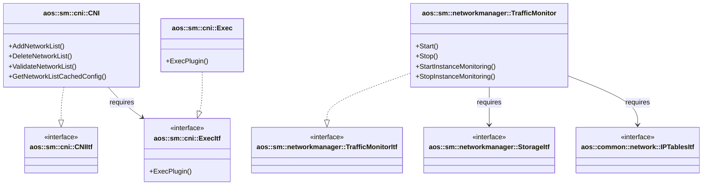

# Network manager (Platform-specific implementation)

The Service Manager Network manager provides platform-specific implementation for network operations in service
instances. It handles CNI (Container Network Interface) plugin execution, traffic monitoring via iptables, and network
cleanup operations.

This is a platform-specific implementation that works directly with Linux networking primitives:

- CNI plugins for network setup/teardown
- iptables for traffic accounting
- Network namespaces for isolation

It implements the following interfaces:

- [aos::sm::cni::CNIItf][cni-itf] — CNI operations for network lifecycle management;
- [aos::sm::networkmanager::TrafficMonitorItf][trafficmonitor-itf] — traffic monitoring and accounting;

It requires the following interfaces:

- [aos::sm::cni::ExecItf][exec-itf] — executes CNI plugins as external processes;
- [aos::sm::networkmanager::StorageItf][storage-itf] — persistent storage for network state and traffic data;
- [aos::common::network::IPTablesItf][iptables-itf] — iptables operations for traffic accounting;

## Platform-specific components

### CNI (Container Network Interface)

The CNI component provides network setup and teardown for service instances using standard CNI plugins.

#### Supported plugins

- **bridge** — creates bridge networks with IPAM (IP Address Management)
- **dnsname** — provides DNS resolution within the network
- **aos-firewall** — applies firewall rules for instance isolation
- **bandwidth** — enforces network bandwidth limits

#### CNI initialization

During initialization (`Init`):

- receives `ExecItf` implementation for plugin execution
- sets CNI configuration directory via `SetConfDir`

#### CNI responsibilities

- **AddNetworkList** — executes CNI plugin chain with ADD command:
  - creates bridge network with allocated IP
  - configures DNS resolution
  - applies firewall rules
  - sets bandwidth limits
  - caches network configuration for cleanup

- **DeleteNetworkList** — executes CNI plugin chain with DEL command:
  - removes instance from network
  - cleans up firewall rules
  - releases network resources
  - removes cached configuration

- **ValidateNetworkList** — validates CNI configuration structure

- **GetNetworkListCachedConfig** — retrieves cached network configuration for deletion

#### CNI plugin execution

Plugins are executed sequentially via `ExecItf`:

1. Plugin payload (JSON) is prepared
2. Environment variables are set (CNI_COMMAND, CNI_ARGS, CNI_PATH, etc.)
3. Plugin binary is executed at `/opt/cni/bin/<plugin-name>`
4. Previous plugin result is passed to next plugin in chain
5. Final result contains interface, IP, route, and DNS information

### ExecItf implementation

The `Exec` class provides platform-specific plugin execution:

- Launches CNI plugin binaries as external processes
- Passes JSON payload via stdin
- Sets environment variables for CNI specification
- Captures stdout/stderr output
- Implements retry logic for "text file busy" errors
- Parses plugin error messages from JSON output

Platform dependencies:

- Uses `Poco::Process` for process management
- Requires CNI plugin binaries in `/opt/cni/bin/`
- Relies on Linux process execution primitives

### Traffic monitor

The Traffic Monitor provides network traffic accounting using iptables packet counters.

#### TrafficMonitor initialization

During initialization (`Init`):

- receives `StorageItf` for persisting traffic data
- receives `IPTablesItf` for iptables operations
- creates system-level chains: `AOS_SYSTEM_IN` and `AOS_SYSTEM_OUT`
- restores traffic counters from storage
- sets monitoring update period (default: 1 minute)

#### TrafficMonitor responsibilities

- **Start** — begins periodic traffic data collection and storage

- **Stop** — stops monitoring, cleans up iptables chains

- **StartInstanceMonitoring** — creates iptables chains for instance traffic:
  - creates `AOS_<hash>_IN` and `AOS_<hash>_OUT` chains
  - inserts rules into FORWARD chain
  - adds accounting rules for instance IP and subnet

- **StopInstanceMonitoring** — removes instance chains and rules

- **SetPeriod** — changes traffic monitoring period

#### Platform-specific implementation

Traffic monitoring relies on Linux iptables:

- Creates custom chains for traffic accounting
- Uses packet counters to track incoming/outgoing traffic
- Periodically reads counters via `ListAllRulesWithCounters`
- Stores cumulative traffic data in database
- Requires `iptables` command-line tool

#### Traffic data storage

Traffic counters are persisted via `StorageItf`:

- Chain name → (timestamp, byte count) mapping
- Cumulative traffic accounting across restarts
- Per-instance and system-level tracking

## Platform requirements

This implementation requires:

- Linux operating system
- CNI plugin binaries in `/opt/cni/bin/`:
  - `bridge`
  - `dnsname`
  - `aos-firewall`
  - `bandwidth`
- `iptables` command-line tool
- Root or CAP_NET_ADMIN privileges for network operations
- Network namespace support in kernel

[cni-itf]: https://github.com/aosedge/aos_core_lib_cpp/tree/main/src/core/sm/networkmanager/itf/cni.hpp
[trafficmonitor-itf]: https://github.com/aosedge/aos_core_lib_cpp/tree/main/src/core/sm/networkmanager/itf/trafficmonitor.hpp
[exec-itf]: https://github.com/aosedge/aos_core_cpp/tree/main/src/sm/networkmanager/exec.hpp
[storage-itf]: https://github.com/aosedge/aos_core_lib_cpp/tree/main/src/core/sm/networkmanager/itf/storage.hpp
[iptables-itf]: https://github.com/aosedge/aos_core_cpp/tree/main/src/common/network/itf/iptables.hpp
