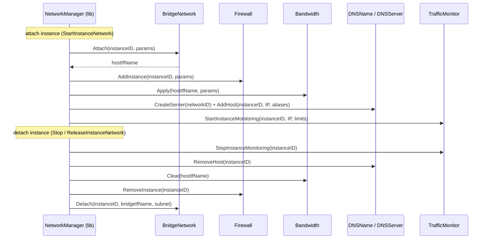

# Network manager (Platform-specific implementation)

The Service Manager network stack sets up and tears down per-instance
networking natively, working directly with Linux primitives — veth pairs and
bridges, network namespaces, nftables, the tc traffic-control subsystem, and a
per-bridge `dnsmasq`. There is no CNI plugin invocation and no iptables.

Orchestration lives in the core library: `NetworkManager` (in
`aos_core_lib_cpp`) drives the per-instance lifecycle purely through
interfaces. This repository provides the concrete platform implementations of
those interfaces:

- [aos::sm::networkmanager::BridgeNetworkItf][bridgenetwork-itf] — `BridgeNetwork`;
- [aos::sm::networkmanager::FirewallItf][firewall-itf] — `Firewall`;
- [aos::sm::networkmanager::BandwidthItf][bandwidth-itf] — `Bandwidth`;
- [aos::sm::networkmanager::DNSNameItf][dnsname-itf] / DNSServerItf — `DNSName` / `DNSServer`;
- [aos::sm::networkmanager::TrafficMonitorItf][trafficmonitor-itf] — `TrafficMonitor`.

These implementations build on the low-level backends documented in the
[common network module](../../common/network/network.md): `NFTables`
(`FWBackendItf`), `TC` (`TCBackendItf`), `InterfaceManager` /
`InterfaceFactory`, `NamespaceManager`, and `PocoProcessSpawner`
(`ProcessSpawnerItf`). Network and traffic state is persisted through
[aos::sm::networkmanager::StorageItf][storage-itf].

```mermaid
classDiagram
    class NetworkManager["aos::sm::networkmanager::NetworkManager (lib)"] {
        +CreateInstanceNetwork()
        +StartInstanceNetwork()
        +StopInstanceNetwork()
        +ReleaseInstanceNetwork()
        +GetInstanceTraffic()
        +GetSystemTraffic()
    }

    class BridgeNetwork["aos::sm::networkmanager::BridgeNetwork"] {
        +Attach()
        +Detach()
    }
    class Firewall["aos::sm::networkmanager::Firewall"] {
        +Start()
        +Stop()
        +AddInstance()
        +RemoveInstance()
        +UpdateInstance()
        +AddMasquerade()
        +RemoveMasquerade()
    }
    class Bandwidth["aos::sm::networkmanager::Bandwidth"] {
        +Apply()
        +Clear()
    }
    class DNSName["aos::sm::networkmanager::DNSName"] {
        +CreateServer()
        +RemoveServer()
        +RemoveOrphans()
    }
    class DNSServer["aos::sm::networkmanager::DNSServer"] {
        +AddHost()
        +RemoveHost()
    }
    class TrafficMonitor["aos::sm::networkmanager::TrafficMonitor"] {
        +Start()
        +Stop()
        +StartInstanceMonitoring()
        +StopInstanceMonitoring()
        +GetInstanceTraffic()
        +GetSystemTraffic()
    }

    class BridgeNetworkItf["BridgeNetworkItf"] {
        <<interface>>
    }
    class FirewallItf["FirewallItf"] {
        <<interface>>
    }
    class BandwidthItf["BandwidthItf"] {
        <<interface>>
    }
    class DNSNameItf["DNSNameItf"] {
        <<interface>>
    }
    class TrafficMonitorItf["TrafficMonitorItf"] {
        <<interface>>
    }
    class FWBackendItf["common::network::FWBackendItf"] {
        <<interface>>
    }
    class TCBackendItf["common::network::TCBackendItf"] {
        <<interface>>
    }
    class ProcessSpawnerItf["common::process::ProcessSpawnerItf"] {
        <<interface>>
    }
    class StorageItf["StorageItf"] {
        <<interface>>
    }

    BridgeNetwork ..|> BridgeNetworkItf
    Firewall ..|> FirewallItf
    Bandwidth ..|> BandwidthItf
    DNSName ..|> DNSNameItf
    DNSServer ..|> DNSServerItf
    TrafficMonitor ..|> TrafficMonitorItf

    NetworkManager --> BridgeNetworkItf : orchestrates
    NetworkManager --> FirewallItf : orchestrates
    NetworkManager --> BandwidthItf : orchestrates
    NetworkManager --> DNSNameItf : orchestrates
    NetworkManager --> TrafficMonitorItf : orchestrates

    Firewall --> FWBackendItf : nft table inet aos
    TrafficMonitor --> FWBackendItf : nft table inet aos-traffic
    TrafficMonitor --> StorageItf : persists counters
    Bandwidth --> TCBackendItf : TBF / ingress / mirred
    DNSName ..> DNSServer : creates per network
    DNSName --> ProcessSpawnerItf : spawn / kill dnsmasq
    DNSServer --> ProcessSpawnerItf : SIGHUP reload
```

## Per-instance lifecycle

`NetworkManager` attaches an instance by calling the implementations in
dependency order; on any failure it unwinds the steps already done, and the
same steps run in reverse on teardown. The host-side veth name produced by
`BridgeNetwork::Attach` flows to `Bandwidth` and is persisted in storage so
that, after an SM restart, recovery cleanup can shape down / detach the right
interface.

```mermaid
sequenceDiagram
    participant NM as NetworkManager (lib)
    participant Bridge as BridgeNetwork
    participant FW as Firewall
    participant BW as Bandwidth
    participant DNS as DNSName / DNSServer
    participant TM as TrafficMonitor

    Note over NM: attach instance (StartInstanceNetwork)
    NM->>Bridge: Attach(instanceID, params)
    Bridge-->>NM: hostIfName
    NM->>FW: AddInstance(instanceID, params)
    NM->>BW: Apply(hostIfName, params)
    NM->>DNS: CreateServer(networkID) + AddHost(instanceID, IP, aliases)
    NM->>TM: StartInstanceMonitoring(instanceID, IP, limits)

    Note over NM: detach instance (Stop / ReleaseInstanceNetwork)
    NM->>TM: StopInstanceMonitoring(instanceID)
    NM->>DNS: RemoveHost(instanceID)
    NM->>BW: Clear(hostIfName)
    NM->>FW: RemoveInstance(instanceID)
    NM->>Bridge: Detach(instanceID, bridgeIfName, subnet)
```

## Platform-specific components

### BridgeNetwork

Native bridge + veth implementation of `BridgeNetworkItf` (replaces the CNI
bridge plugin).

- **Attach** — creates a veth pair, attaches the host end to the network's
  bridge, moves the peer end into the instance netns, and configures its IP,
  route and hairpin. Returns the host-side veth name in the attach result.
- **Detach** — removes the veth (which auto-removes the peer).

Requires only `InterfaceManagerItf` (link/address/route/netns operations). The
IPMasq rule is a per-network property owned by `NetworkManager`
(CreateNetwork / ClearNetwork), not by this per-instance attach.

### Firewall

Native `FirewallItf` backed by the nftables `FWBackendItf`. All rules live in
the `inet aos` table.

- **Start / Stop** — create the base table and chains / tear them down.
- **AddInstance / UpdateInstance / RemoveInstance** — manage a per-instance
  chain holding the instance's input/output rules; `UpdateInstance` replaces a
  chain's contents atomically.
- **AddMasquerade / RemoveMasquerade** — add/remove an IPMasq rule in the
  `postrouting` chain for a source subnet, masquerading egress via any
  interface but the bridge (`oifname != "<bridge>"`). Installed once per
  network by `NetworkManager` on create/clear.

### Bandwidth

Native `BandwidthItf` over the tc `TCBackendItf`.

- **Apply** — installs a root TBF qdisc on the host-side veth (rate-limits
  traffic *into* the container) and, for the other direction, creates an IFB
  pseudo-device with an ingress mirred redirect plus a root TBF on the IFB
  (rate-limits traffic *out of* the container). The IFB name is derived
  deterministically from the host veth name.
- **Clear** — removes the shaping; idempotent (eNone when nothing is installed).

Requires `TCBackendItf`, `InterfaceFactoryItf` (creates the IFB device) and
`InterfaceManagerItf` (brings it up / removes it).

### DNSName / DNSServer

Per-bridge DNS: one `dnsmasq` process per network (replaces the CNI `dnsname`
plugin). `DNSName` is the factory (`DNSNameItf`); `DNSServer` is the
per-network handle (`DNSServerItf`).

- **DNSName.CreateServer** — returns the network's `DNSServer`, spawning a
  `dnsmasq` for the bridge if one is not already running. On restart it adopts
  a still-alive process by reading `<storageDir>/pidfile` (verified via the
  spawner's command line), or kills a stale one and respawns.
- **DNSName.RemoveServer** — tears down a network's DNS server.
- **DNSName.RemoveOrphans** — scans the DNS storage root and reaps per-network
  directories whose networkID is no longer known.
- **DNSServer.AddHost / RemoveHost** — rewrite `<storageDir>/addnhosts` with the
  instance's IP and aliases, then signal `dnsmasq` with SIGHUP (via
  `ProcessSpawnerItf`) so the change is picked up without a restart. Each alias
  is published both bare and as `<alias>.<networkID>`.

`dnsmasq` is run via `ProcessSpawnerItf` with `--addn-hosts` / `--pid-file` /
`--bind-interfaces`.

### TrafficMonitor

Native `TrafficMonitorItf` backed by the nftables `FWBackendItf`. Counters live
in the `inet aos-traffic` table (separate from the firewall's `inet aos`),
sharing the same `NFTables` backend instance.

- **Start / Stop** — create the system chains (`in_system` / `out_system`) and
  start the periodic poll / tear everything down.
- **StartInstanceMonitoring / StopInstanceMonitoring** — add/remove per-instance
  `in_<id>` / `out_<id>` counter chains for the instance IP.
- **GetInstanceTraffic / GetSystemTraffic** — return accumulated byte counts.
- **SetPeriod** — change the accounting period (default: 1 minute).

Counters are read via `ListChainRules` (which returns per-rule byte/packet
counts) and persisted through `StorageItf` so accounting survives restarts.

## Platform requirements

This implementation requires:

- Linux with network namespace support
- `libnftables`, `libnl` (tc) available at runtime
- a `dnsmasq` binary (default `/usr/sbin/dnsmasq`)
- a writable per-SM DNS storage root (`<workingDir>/dns`)
- root or CAP_NET_ADMIN (and CAP_SYS_ADMIN for namespaces)

There are **no** CNI plugin binaries (`/opt/cni/bin/...`) and **no** `iptables`
dependency — the CNI bridge/dnsname/aos-firewall/bandwidth plugins, the CNI
exec/JSON/cache layer, and the iptables traffic backend have all been replaced
by the native implementations above.

[bridgenetwork-itf]: https://github.com/aosedge/aos_core_lib_cpp/tree/main/src/core/sm/networkmanager/itf/bridgenetwork.hpp
[firewall-itf]: https://github.com/aosedge/aos_core_lib_cpp/tree/main/src/core/sm/networkmanager/itf/firewall.hpp
[bandwidth-itf]: https://github.com/aosedge/aos_core_lib_cpp/tree/main/src/core/sm/networkmanager/itf/bandwidth.hpp
[dnsname-itf]: https://github.com/aosedge/aos_core_lib_cpp/tree/main/src/core/sm/networkmanager/itf/dnsname.hpp
[trafficmonitor-itf]: https://github.com/aosedge/aos_core_lib_cpp/tree/main/src/core/sm/networkmanager/itf/trafficmonitor.hpp
[storage-itf]: https://github.com/aosedge/aos_core_lib_cpp/tree/main/src/core/sm/networkmanager/itf/storage.hpp
