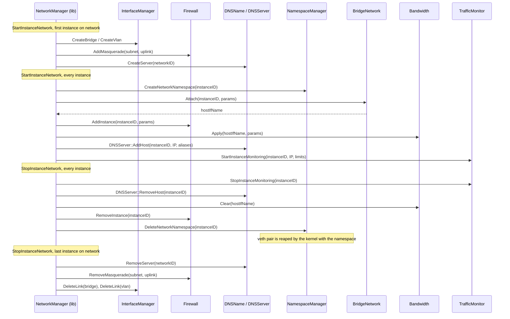

# Network manager (platform-specific implementation)

The SM network stack builds and tears down per-instance networking natively, working directly with Linux primitives:
veth pairs and bridges, network namespaces, nftables, the tc traffic-control subsystem and a per-bridge dnsmasq. There
are no CNI plugin binaries and no iptables.

The overall networking architecture is described in the public documentation:

- [Networking overview][arch-overview];
- [Per-instance network lifecycle][arch-lifecycle].

Orchestration lives in the core library: [aos::sm::networkmanager::NetworkManager][lib-networkmanager] drives the
node/instance network lifecycle (create, start, stop, release, batch, reconciliation, deferred firewall updates) purely
through interfaces. The contract between SM and CM is described in [common network manager][common-networkmanager].
This repository provides the platform implementations of the interfaces the library requires:

- [aos::sm::networkmanager::BridgeNetworkItf][bridgenetwork-itf] - [BridgeNetwork](bridgenetwork.hpp);
- [aos::sm::networkmanager::FirewallItf][firewall-itf] - [Firewall](firewall.hpp);
- [aos::sm::networkmanager::BandwidthItf][bandwidth-itf] - [Bandwidth](bandwidth.hpp);
- [aos::sm::networkmanager::DNSNameItf][dnsname-itf] - [DNSName](dnsname.hpp);
- [aos::sm::networkmanager::DNSServerItf][dnsname-itf] - [DNSServer](dnsserver.hpp);
- [aos::sm::networkmanager::TrafficMonitorItf][trafficmonitor-itf] - [TrafficMonitor](trafficmonitor.hpp).

These implementations build on the following backends:

- [aos::sm::nftables::FWBackendItf](../nftables/itf/firewallbackend.hpp) - transactional nftables backend
  ([NFTables](../nftables/nftables.hpp)), shared by `Firewall` and `TrafficMonitor`;
- [aos::common::network::TCBackendItf](../../common/network/itf/tcbackend.hpp) - tc backend (`TC`);
- [aos::sm::networkmanager::InterfaceManagerItf][interfacemanager-itf] and
  [aos::sm::networkmanager::InterfaceFactoryItf][interfacefactory-itf] - netlink link management (`InterfaceManager`);
- [aos::common::process::ProcessSpawnerItf](../../common/process/itf/processspawner.hpp) - dnsmasq process
  management (`PocoProcessSpawner`);
- [aos::sm::networkmanager::StorageItf][storage-itf] - persists traffic counters.

`InterfaceManager`, `NamespaceManager` and `TC` are described in the
[common network module](../../common/network/network.md).

[arch-overview]: https://github.com/aosedge/public-docs/blob/main/docs/aos-core/14-network/index.md
[arch-lifecycle]: https://github.com/aosedge/public-docs/blob/main/docs/aos-core/14-network/per-instance-networking.md
[lib-networkmanager]: https://github.com/aosedge/aos_core_lib_cpp/blob/develop/src/core/sm/networkmanager/networkmanager.md
[common-networkmanager]: https://github.com/aosedge/aos_core_lib_cpp/blob/develop/src/core/common/networkmanager/networkmanager.md
[bridgenetwork-itf]: https://github.com/aosedge/aos_core_lib_cpp/blob/develop/src/core/sm/networkmanager/itf/bridgenetwork.hpp
[firewall-itf]: https://github.com/aosedge/aos_core_lib_cpp/blob/develop/src/core/sm/networkmanager/itf/firewall.hpp
[bandwidth-itf]: https://github.com/aosedge/aos_core_lib_cpp/blob/develop/src/core/sm/networkmanager/itf/bandwidth.hpp
[dnsname-itf]: https://github.com/aosedge/aos_core_lib_cpp/blob/develop/src/core/sm/networkmanager/itf/dnsname.hpp
[trafficmonitor-itf]: https://github.com/aosedge/aos_core_lib_cpp/blob/develop/src/core/sm/networkmanager/itf/trafficmonitor.hpp
[interfacemanager-itf]: https://github.com/aosedge/aos_core_lib_cpp/blob/develop/src/core/sm/networkmanager/itf/interfacemanager.hpp
[interfacefactory-itf]: https://github.com/aosedge/aos_core_lib_cpp/blob/develop/src/core/sm/networkmanager/itf/interfacefactory.hpp
[storage-itf]: https://github.com/aosedge/aos_core_lib_cpp/blob/develop/src/core/sm/networkmanager/itf/storage.hpp

```mermaid
classDiagram
    direction TB

    class NetworkManager ["aos::sm::networkmanager::NetworkManager (lib)"] {
    }

    class BridgeNetworkItf ["aos::sm::networkmanager::BridgeNetworkItf"] {
        <<interface>>
    }
    class BandwidthItf ["aos::sm::networkmanager::BandwidthItf"] {
        <<interface>>
    }
    class FirewallItf ["aos::sm::networkmanager::FirewallItf"] {
        <<interface>>
    }
    class TrafficMonitorItf ["aos::sm::networkmanager::TrafficMonitorItf"] {
        <<interface>>
    }
    class DNSNameItf ["aos::sm::networkmanager::DNSNameItf"] {
        <<interface>>
    }
    class DNSServerItf ["aos::sm::networkmanager::DNSServerItf"] {
        <<interface>>
    }

    class BridgeNetwork ["aos::sm::networkmanager::BridgeNetwork"] {
    }
    class Bandwidth ["aos::sm::networkmanager::Bandwidth"] {
    }
    class Firewall ["aos::sm::networkmanager::Firewall"] {
    }
    class TrafficMonitor ["aos::sm::networkmanager::TrafficMonitor"] {
    }
    class DNSName ["aos::sm::networkmanager::DNSName"] {
    }
    class DNSServer ["aos::sm::networkmanager::DNSServer"] {
    }

    class InterfaceManagerItf ["aos::sm::networkmanager::InterfaceManagerItf"] {
        <<interface>>
    }
    class InterfaceFactoryItf ["aos::sm::networkmanager::InterfaceFactoryItf"] {
        <<interface>>
    }
    class TCBackendItf ["aos::common::network::TCBackendItf"] {
        <<interface>>
    }
    class FWBackendItf ["aos::sm::nftables::FWBackendItf"] {
        <<interface>>
    }
    class StorageItf ["aos::sm::networkmanager::StorageItf"] {
        <<interface>>
    }
    class ProcessSpawnerItf ["aos::common::process::ProcessSpawnerItf"] {
        <<interface>>
    }

    %% library -> required interfaces
    NetworkManager ..> BridgeNetworkItf
    NetworkManager ..> BandwidthItf
    NetworkManager ..> FirewallItf
    NetworkManager ..> TrafficMonitorItf
    NetworkManager ..> DNSNameItf
    NetworkManager ..> DNSServerItf

    %% interfaces <- platform implementations
    BridgeNetworkItf <|.. BridgeNetwork
    BandwidthItf <|.. Bandwidth
    FirewallItf <|.. Firewall
    TrafficMonitorItf <|.. TrafficMonitor
    DNSNameItf <|.. DNSName
    DNSServerItf <|.. DNSServer

    %% implementations -> backends
    BridgeNetwork ..> InterfaceManagerItf
    Bandwidth ..> InterfaceManagerItf
    Bandwidth ..> InterfaceFactoryItf
    Bandwidth ..> TCBackendItf
    Firewall ..> FWBackendItf
    TrafficMonitor ..> FWBackendItf
    TrafficMonitor ..> StorageItf
    DNSName ..> ProcessSpawnerItf
    DNSServer ..> ProcessSpawnerItf
```

## Per-instance lifecycle

The library calls the implementations in dependency order and unwinds the completed steps on failure. The sequence
below shows only the calls that reach this repository; the full lifecycle (CM calls, storage, cache, batch,
reconciliation) is described in the [library document][lib-networkmanager].

```mermaid
sequenceDiagram
    participant NM as NetworkManager (lib)
    participant IF as InterfaceManager
    participant FW as Firewall
    participant DNS as DNSName / DNSServer
    participant NS as NamespaceManager
    participant BR as BridgeNetwork
    participant BW as Bandwidth
    participant TM as TrafficMonitor

    Note over NM: StartInstanceNetwork, first instance on network
    NM ->> IF: CreateBridge / CreateVlan
    NM ->> FW: AddMasquerade(subnet, uplink)
    NM ->> DNS: CreateServer(networkID)

    Note over NM: StartInstanceNetwork, every instance
    NM ->> NS: CreateNetworkNamespace(instanceID)
    NM ->> BR: Attach(instanceID, params)
    BR -->> NM: hostIfName
    NM ->> FW: AddInstance(instanceID, params)
    NM ->> BW: Apply(hostIfName, params)
    NM ->> DNS: DNSServer::AddHost(instanceID, IP, aliases)
    NM ->> TM: StartInstanceMonitoring(instanceID, IP, limits)

    Note over NM: StopInstanceNetwork, every instance
    NM ->> TM: StopInstanceMonitoring(instanceID)
    NM ->> DNS: DNSServer::RemoveHost(instanceID)
    NM ->> BW: Clear(hostIfName)
    NM ->> FW: RemoveInstance(instanceID)
    NM ->> NS: DeleteNetworkNamespace(instanceID)
    Note over NS: veth pair is reaped by the kernel with the namespace

    Note over NM: StopInstanceNetwork, last instance on network
    NM ->> DNS: RemoveServer(networkID)
    NM ->> FW: RemoveMasquerade(subnet, uplink)
    NM ->> IF: DeleteLink(bridge), DeleteLink(vlan)
```

## BridgeNetwork

`BridgeNetworkItf` implementation over `InterfaceManagerItf`. Owns the per-instance veth lifecycle. The host-side
veth name is derived deterministically from the instance ID (`veth` + hash), so `Detach` can find it without
persisted state.

- **Attach** - creates the veth pair with the peer placed directly into the instance netns, named as the container
  interface (`eth0`), and the host end enslaved to the bridge and up, in a single netlink operation
  (`CreateVethToNamespace`). Then brings the peer up, assigns the IP and installs the default route via the bridge IP
  inside the netns (`ConfigureInstanceInterface`) and enables hairpin on the host end if requested. Returns the host
  and container interface names.
- **Detach** - deletes the host-side veth, which removes the peer as well.

The masquerade rule is a per-network property owned by the library (installed on network creation), not by the
per-instance attach.

## Firewall

`FirewallItf` implementation over `FWBackendItf`. All rules live in the nftables table `inet aos`, which holds two
base chains:

- `forward` (filter, forward hook, policy drop) - per-instance access control. The chain starts with connection
  tracking rules (`ct state invalid` drop, `ct state established,related` accept), so the per-instance rules only
  describe connection initiation;
- `postrouting` (nat, postrouting hook, policy accept) - per-network masquerade.

Each instance gets its own chain `instance_<id>` reached from `forward` by two jump rules matching the instance IP
as destination and as source. The instance chain contains, in order:

1. accept for traffic within the instance subnet in both directions (instances on the same network are not
   restricted);
2. accept for each exposed port (`ip daddr <ip> <proto> dport <port>`);
3. accept for each output access rule (`ip saddr <ip> ip daddr <dst> <proto> dport <port>`);
4. terminal drop for incoming traffic and terminal accept (allow public) or drop for outgoing traffic.

Protocol defaults to `tcp`, only `tcp` and `udp` are supported, ports may be ranges.

- **Start** - if the table with the `forward` chain already exists (provisioned ahead of SM or left by a previous SM
  lifetime), adopts it as is. Otherwise creates the fail-closed skeleton described above. Existing instance chains
  are kept so instances that survived an SM restart stay protected.
- **Stop** - removes the instance chains and masquerade rules SM added, but keeps the table and base chains. The
  fail-closed policy stays in place after SM exits.
- **RemoveOrphans** - removes instance chains and masquerade rules that are not in the known sets. Called by the
  library on start to reap artifacts of a crashed SM without touching the rules of instances that kept running.
- **AddInstance / RemoveInstance** - add or delete the instance chain together with its jump rules in one
  transaction.
- **UpdateInstance** - flushes the instance chain, re-appends the rules and re-points the jump rules at the current
  IP in one transaction. Used for deferred firewall updates.
- **AddMasquerade / RemoveMasquerade** - add or delete `ip saddr <subnet> oifname <uplink> masquerade` in
  `postrouting`. Idempotent per subnet/interface pair.
- **BeginBatch / FlushBatch / AbortBatch / Revert** - in batch mode `AddInstance` and `RemoveInstance` stage their
  operations into one shared transaction. `FlushBatch` commits it in a single nft transaction and records the added
  rule handles. `AbortBatch` drops the staged transaction. `Revert` deletes by handle everything the last flushed
  batch added, together with the instance chains it created.

## Bandwidth

`BandwidthItf` implementation over `TCBackendItf`, `InterfaceFactoryItf` and `InterfaceManagerItf`. Rates are given
in bits/s and converted to bytes/s for tc.

- **Apply** - no-op when both rates are zero. With an ingress rate installs a root TBF qdisc on the host-side veth
  (host veth egress is traffic into the container). With an egress rate creates an IFB pseudo-device, adds an ingress
  qdisc with a mirred redirect from the host veth to the IFB and installs a root TBF qdisc on the IFB (host veth
  ingress is traffic out of the container). The IFB name is derived deterministically from the host veth name
  (`ifb-` + hash).
- **Clear** - deletes the IFB device. The TBF on the host veth is removed with the veth itself. Idempotent.

## DNSName / DNSServer

Per-bridge DNS: one dnsmasq process per network. `DNSName` implements `DNSNameItf` and owns the processes;
`DNSServer` implements `DNSServerItf` and is the per-network handle returned by `DNSName`.

Each network has a storage directory `<dnsStoragePath>/<networkID>` (in SM it is `<workingDir>/dns`) with the
`addnhosts` and `pidfile` files. dnsmasq is spawned via `ProcessSpawnerItf` in foreground mode, bound to the bridge
interface and the bridge IP, with `--addn-hosts` and `--pid-file` pointing to that directory. Upstream resolution
uses `/etc/resolv.conf` of the host.

- **DNSName::CreateServer** - idempotent per network. If the PID file names a process that is alive and whose command
  line points to this network's PID file, the dnsmasq is adopted; otherwise a new one is spawned. The `DNSServer`
  handle loads the existing `addnhosts` on init, so an adopted dnsmasq keeps serving the instances that are still
  running.
- **DNSName::RemoveServer** - kills the dnsmasq and wipes the network storage directory.
- **DNSName::RemoveOrphans** - scans the storage root and, for every network directory not in the known set, kills the
  process from its PID file and wipes the directory. Called by the library on start.
- **DNSServer::AddHost / RemoveHost** - update the instance record (IP and names) and rewrite `addnhosts`, then send
  `SIGHUP` to dnsmasq so the change is picked up without restart. Each alias is published both bare and as
  `<alias>.<networkID>`. Every line is tagged with the instance ID so the file can be reloaded on adoption.

## TrafficMonitor

`TrafficMonitorItf` implementation over `FWBackendItf` and `StorageItf`. Counters live in a separate nftables table
`inet aos-traffic` with three base chains (`input`, `output`, `forward`, all policy accept). The counter chains only
count and return, so the firewall table on the same hook stays authoritative.

- **Init** - drops a stale `aos-traffic` table if present and creates the table, the base chains and the system
  chains `in_system` / `out_system` hooked from `input` / `output`. Default traffic period is day; the counters are
  polled every minute unless another update period is given.
- **Start / Stop** - start and stop the polling timer. `Stop` also deletes the `aos-traffic` table and drops the
  in-memory state.
- **StartInstanceMonitoring / StopInstanceMonitoring** - add or remove the `in_<id>` / `out_<id>` chains for the
  instance IP, hooked from `forward` by jump rules matching the IP as destination / source. Traffic to and from
  private networks is excluded from the counters. Previously accumulated values for the chains are restored from the
  storage. On stop the current values are persisted.
- **GetInstanceTraffic / GetSystemTraffic** - return the accumulated byte counts for the current period.
- **SetPeriod** - sets the accounting period (minute, hour, day, month, year). Counters are reset at period
  boundaries.
- **BeginBatch / FlushBatch / AbortBatch / Revert** - same batch semantics as the firewall: instance chains are staged
  into one transaction, committed atomically, and can be reverted by handle.

On every poll the monitor reads the counter of each chain via `ListChainRules`, updates the per-period value,
persists it to the storage and enforces the limit: when the download or upload limit of an instance is exceeded, the
corresponding chain is switched to a drop rule until the next period starts.

## Platform requirements

- Linux with network namespaces, nftables and tc support;
- `libnftables` and `libnl` (route, tc) at runtime;
- a dnsmasq binary at `/usr/sbin/dnsmasq`;
- a writable DNS storage directory (`<workingDir>/dns`);
- `CAP_NET_ADMIN` for links, nftables and tc, `CAP_SYS_ADMIN` for network namespaces.
